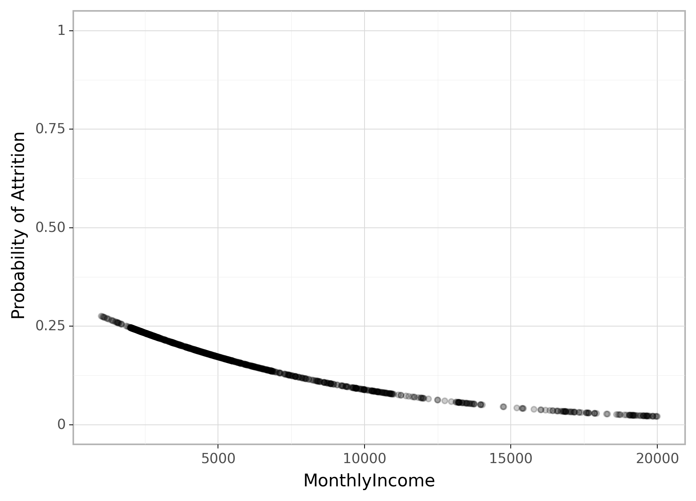
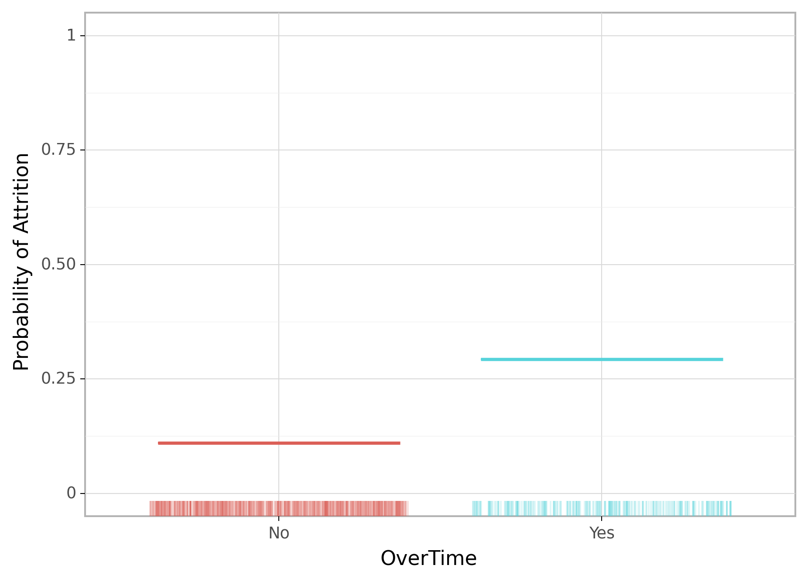
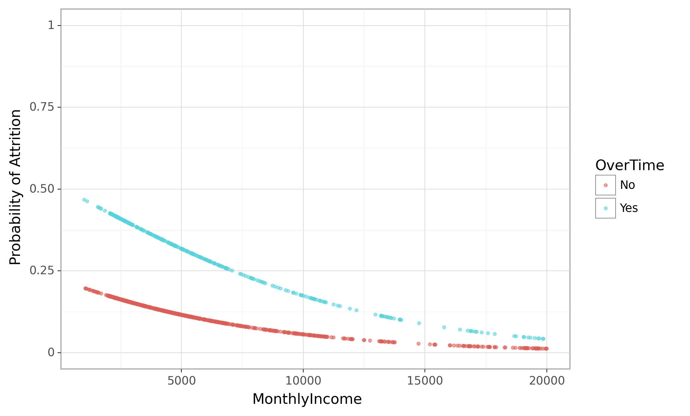

<br>

```{r 04-setup, include=FALSE}

# Set global knitr chunk options
knitr::opts_chunk$set(echo = TRUE, warning = FALSE, message = FALSE, 
                      collapse = TRUE, fig.align = 'center')

library(reticulate)
use_virtualenv("/Users/b294776/Desktop/Workspace/Projects/misk/misk-homl/venv", required = TRUE)

# Set the graphical theme
ggplot2::theme_set(ggplot2::theme_light())
```

```{python, echo = FALSE}
import plotnine
plotnine.themes.theme_set(new=plotnine.themes.theme_light())
```

Linear regression is used to approximate the (linear) relationship between a continuous response variable and a set of predictor variables. However, when the response variable is binary (i.e., Yes/No), linear regression is not appropriate. Fortunately, analysts can turn to an analogous method, logistic regression, which is similar to linear regression in many ways.  This module explores the use of logistic regression for binary response variables. Logistic regression can be expanded for multinomial problems (see @faraway2016extending for discussion of multinomial logistic regression in R); however, that goes beyond our intent here.

# Learning objectives

By the end of this module you will:

- Understand why linear regression does not work for binary response variables.
- Know how to apply and interpret simple and multiple logistic regression models.
- Know how to assess model accuracy of various logistic regression models.

# Prerequisites {.tabset}

For this section we'll use the following packages:

## `r fontawesome::fa("python")` 

```{python}
# Helper packages
import pandas as pd
from plotnine import *

# Modeling packages
from sklearn.model_selection import train_test_split
from sklearn.preprocessing import OneHotEncoder
from sklearn.linear_model import LogisticRegression
from sklearn.linear_model import LogisticRegressionCV
from sklearn.metrics import roc_auc_score, plot_roc_curve
```

To illustrate logistic regression concepts we'll use the employee attrition data, where our intent is to predict the `Attrition` response variable (coded as `"Yes"`/`"No"`). As in the previous module, we'll set aside 30% of our data as a test set to assess our generalizability error.

```{python}
churn = pd.read_csv("data/attrition.csv")

# recode response variable to 1/0
churn = churn.replace({"Attrition": {"Yes": 1, "No": 0}})

# create train/test split
train, test = train_test_split(
  churn, 
  train_size=0.7, 
  random_state=123, 
  stratify=churn[["Attrition"]],
  )

# separate features from labels and only use numeric features
X_train = train.drop("Attrition", axis=1)
y_train = train[["Attrition"]].values.ravel()
```

## `r fontawesome::fa("r-project")`

```{r 05-pkgs, message=FALSE}
# Helper packages
library(tidyverse) # for data wrangling & plotting

# Modeling packages
library(tidymodels)

# Model interpretability packages
library(vip)      # variable importance
```

To illustrate logistic regression concepts we'll use the employee attrition data, where our intent is to predict the `Attrition` response variable (coded as `"Yes"`/`"No"`). As in the previous module, we'll set aside 30% of our data as a test set to assess our generalizability error.

```{r logit-data-import}
churn <- read_csv("data/attrition.csv")

# recode response variable as a factor
churn <- mutate(churn, Attrition = as.factor(Attrition))

# Create training (70%) and test (30%) sets for the 
# rsample::attrition data.
set.seed(123)  # for reproducibility
churn_split <- initial_split(churn, prop = .7, strata = "Attrition")
churn_train <- training(churn_split)
churn_test  <- testing(churn_split)
```

# Why logistic regression

To provide a clear motivation for logistic regression, assume we have credit card default data for customers and we want to understand if the current credit card balance of a customer is an indicator of whether or not they'll default on their credit card.  To classify a customer as a high- vs. low-risk defaulter based on their balance we could use linear regression; however, the left plot below illustrates how linear regression would predict the probability of defaulting. Unfortunately, for balances close to zero we predict a negative probability of defaulting; if we were to predict for very large balances, we would get values bigger than 1. These predictions are not sensible, since of course the true probability of defaulting, regardless of credit card balance, must fall between 0 and 1. These inconsistencies only increase as our data become more imbalanced and the number of outliers increase. Contrast this with the logistic regression line (right plot) that is nonlinear (sigmoidal-shaped).   

```{r whylogit, echo=FALSE, fig.height=3, fig.width=8, fig.cap="Figure: Comparing the predicted probabilities of linear regression (left) to logistic regression (right). Predicted probabilities using linear regression results in flawed logic whereas predicted values from logistic regression will always lie between 0 and 1."}
p1 <- ISLR::Default %>%
  mutate(prob = ifelse(default == "Yes", 1, 0)) %>%
  ggplot(aes(balance, prob)) +
  geom_point(alpha = .15) +
  geom_smooth(method = "lm") +
  ggtitle("Linear regression model fit") +
  xlab("Balance") +
  ylab("Probability of Default")

p2 <- ISLR::Default %>%
  mutate(prob = ifelse(default == "Yes", 1, 0)) %>%
  ggplot(aes(balance, prob)) +
  geom_point(alpha = .15) +
  geom_smooth(method = "glm", method.args = list(family = "binomial")) +
  ggtitle("Logistic regression model fit") +
  xlab("Balance") +
  ylab("Probability of Default")

gridExtra::grid.arrange(p1, p2, nrow = 1)
```


To avoid the inadequacies of the linear model fit on a binary response, we must model the probability of our response using a function that gives outputs between 0 and 1 for all values of $X$. Many functions meet this description. In logistic regression, we use the logistic function, which is defined as the following equation and produces the S-shaped curve in the right plot above.

\begin{equation}
  p\left(X\right) = \frac{e^{\beta_0 + \beta_1X}}{1 + e^{\beta_0 + \beta_1X}}
\end{equation}

The $\beta_i$ parameters represent the coefficients as in linear regression and $p\left(X\right)$ may be interpreted as the probability that the positive class (default in the above example) is present.  The minimum for $p\left(x\right)$ is obtained at $\lim_{a \rightarrow -\infty} \left[ \frac{e^a}{1+e^a} \right] = 0$, and the maximum for $p\left(x\right)$ is obtained at $\lim_{a \rightarrow \infty} \left[ \frac{e^a}{1+e^a} \right] = 1$ which restricts the output probabilities to 0--1. Rearranging the above equation yields the _logit transformation_\index{logit transformation} (which is where logistic regression gets its name):

\begin{equation}
  g\left(X\right) = \ln \left[ \frac{p\left(X\right)}{1 - p\left(X\right)} \right] = \beta_0 + \beta_1 X
\end{equation}

Applying a logit transformation to $p\left(X\right)$ results in a linear equation similar to the mean response in a simple linear regression model. Using the logit transformation also results in an intuitive interpretation for the magnitude of $\beta_1$: the odds (e.g., of defaulting) increase multiplicatively by $\exp\left(\beta_1\right)$ for every one-unit increase in $X$. A similar interpretation exists if $X$ is categorical; see @agresti2003categorical, Chapter 5, for details.

# Simple logistic regression

We will fit two logistic regression models in order to predict the probability of an employee attriting. The first predicts the probability of attrition based on their monthly income (`MonthlyIncome`) and the second is based on whether or not the employee works overtime (`OverTime`). 

```{block, type="note"}
To simplify the code we do not run cross validation procedures. We will in a later section but for now we simply want to get a grasp of interpreting a logistic regression model.
```

## Implementation {.tabset}

### `r fontawesome::fa("python")`

```{python}
# model 1
lr_mod = LogisticRegression()
lr_fit1 = lr_mod.fit(X_train[["MonthlyIncome"]], y_train)
```

Since the `OverTime` feature is categorical we'll need to dummy encode.

```{python}
overtime = pd.get_dummies(X_train[["OverTime"]].copy())

# model 2
lr_mod = LogisticRegression()
lr_fit2 = lr_mod.fit(overtime, y_train)
```


### `r fontawesome::fa("r-project")`

```{r}
lr_mod <- logistic_reg() %>% set_engine("glm")

# model 1
lr_fit1 <- lr_mod %>% 
  fit(Attrition ~ MonthlyIncome, data = churn_train)

# model 2
lr_fit2 <- lr_mod %>% 
  fit(Attrition ~ OverTime, data = churn_train)
```


## Interpretation {.tabset}

Bear in mind that the coefficient estimates from logistic regression characterize the relationship between the predictor and response variable on a log-odds (i.e., logit) scale. Unlike, linear regression, this can make interpretation of coefficients difficult. At a macro level, larger coefficients suggest that that feature increases the odds of the response more than smaller valued coefficients.

However, for our purpose, it is easier to focus on the interpretation of the output. The following predicts the probability of employee attrition based on the two models we fit. In the first plot, we can see that as `MonthlyIncome` increases, the predicted probability of attrition decreases from a little over 0.25 to 0.025.

If we look at the second plot, which plots the predicted probability of Attrition based on whether employees work `OverTime`. We can see that employees that work overtime have a 0.3 probability of attrition while those that don't work overtime only have a 0.1 probability of attrition. Basically, working overtimes increases the probability of employee churn by a factor of 3!

### `r fontawesome::fa("python")`

```{python}
lr_fit1.predict_proba(X_train[["MonthlyIncome"]])
```

```{python, eval=FALSE}
pred = pd.DataFrame(
  lr_fit1.predict_proba(X_train[["MonthlyIncome"]]), 
  columns=["No", "Yes"]
  )
  
pred["MonthlyIncome"] = X_train["MonthlyIncome"].reset_index(drop=True)

(ggplot(pred, aes('MonthlyIncome', 'Yes'))
  + geom_point(alpha=0.2)
  + scale_y_continuous(name="Probability of Attrition", limits=(0, 1)))
```

```{python, echo=FALSE}
pred = pd.DataFrame(
  lr_fit1.predict_proba(X_train[["MonthlyIncome"]]), 
  columns=["No", "Yes"]
  )
  
pred["MonthlyIncome"] = X_train["MonthlyIncome"].reset_index(drop=True)

p = (ggplot(pred, aes('MonthlyIncome', 'Yes'))
  + geom_point(alpha=0.2)
  + scale_y_continuous(name="Probability of Attrition", limits=(0, 1)))
  
p.save(filename="py-logit-image1.png", path = "./images", dpi = 300, 
       height=5, width=7, units="in", verbose = False)
```

```{r, echo=FALSE, fig.align='center', out.width="80%"}

```

```{python, eval=FALSE}
pred = pd.DataFrame(
  lr_fit2.predict_proba(overtime),
  columns=["No", "Yes"]
  )

pred["OverTime"] = X_train["OverTime"].reset_index(drop=True)

(ggplot(pred, aes('OverTime', 'Yes', color='OverTime'))
  + geom_boxplot(show_legend=False)
  + geom_rug(sides="b", position="jitter", alpha=0.2, show_legend=False)
  + scale_y_continuous(name="Probability of Attrition", limits=(0, 1))
  )
```

```{python, echo=FALSE}
pred = pd.DataFrame(
  lr_fit2.predict_proba(overtime),
  columns=["No", "Yes"]
  )

pred["OverTime"] = X_train["OverTime"].reset_index(drop=True)

p = (ggplot(pred, aes('OverTime', 'Yes', color='OverTime'))
  + geom_boxplot(show_legend=False)
  + geom_rug(sides="b", position="jitter", alpha=0.2, show_legend=False)
  + scale_y_continuous(name="Probability of Attrition", limits=(0, 1))
  )
  
p.save(filename="py-logit-image2.png", path = "./images", dpi = 300, 
       height=5, width=7, units="in", verbose = False)
```

```{r, echo=FALSE, fig.align='center', out.width="80%"}

```


### `r fontawesome::fa("r-project")`

```{r}
lr_fit1 %>% predict(churn_train, type = "prob")
```

```{r}
lr_fit1 %>% 
 predict(churn_train, type = "prob") %>%
 mutate(MonthlyIncome = churn_train$MonthlyIncome) %>%
 ggplot(aes(MonthlyIncome, .pred_Yes)) +
 geom_point(alpha = .2) +
 scale_y_continuous("Probability of Attrition", limits = c(0, 1))
```

```{r}
lr_fit2 %>% 
 predict(churn_train, type = "prob") %>%
 mutate(OverTime = churn_train$OverTime) %>%
 ggplot(aes(OverTime, .pred_Yes, color = OverTime)) +
 geom_boxplot(show.legend = FALSE) +
 geom_rug(sides = "b", position = "jitter", alpha = 0.2, show.legend = FALSE) +
  scale_y_continuous("Probability of Attrition", limits = c(0, 1))
```


# Multiple logistic regression 

We can also extend our model as seen in our earlier equation so that we can predict a binary response using multiple predictors:

\begin{equation}
p\left(X\right) = \frac{e^{\beta_0 + \beta_1 X + \cdots + \beta_p X_p }}{1 + e^{\beta_0 + \beta_1 X + \cdots + \beta_p X_p}} 
\end{equation}

Let's go ahead and fit a model that predicts the probability of `Attrition` based on the `MonthlyIncome` and `OverTime`.  Our results show that both features have an impact on employee attrition; however, working `OverTime` tends to nearly double the probability of attrition!

## Implementation {.tabset}

### `r fontawesome::fa("python")`

```{python}
feat = pd.get_dummies(X_train[["OverTime"]].copy())
feat["MonthlyIncome"] = X_train["MonthlyIncome"]

# model 3
lr_mod = LogisticRegression()
lr_fit3 = lr_mod.fit(feat, y_train)
```

```{python, eval=FALSE}
pred = pd.DataFrame(
  lr_fit3.predict_proba(feat),
  columns=["No", "Yes"]
  )

pred = pred.join(X_train[["MonthlyIncome", "OverTime"]].reset_index(drop=True))

(ggplot(pred, aes("MonthlyIncome", "Yes", color="OverTime"))
  + geom_point(alpha=0.5, size=0.8)
  + scale_y_continuous(name="Probability of Attrition", limits=(0, 1)))
```

```{python, echo=FALSE}
pred = pd.DataFrame(
  lr_fit3.predict_proba(feat),
  columns=["No", "Yes"]
  )

pred = pred.join(X_train[["MonthlyIncome", "OverTime"]].reset_index(drop=True))

p = (ggplot(pred, aes("MonthlyIncome", "Yes", color="OverTime"))
  + geom_point(alpha=0.5, size=0.8)
  + scale_y_continuous(name="Probability of Attrition", limits=(0, 1)))
  
p.save(filename="py-logit-image3.png", path = "./images", dpi = 300, 
       height=5, width=7, units="in", verbose = False)
```

```{r, echo=FALSE, fig.align='center', out.width="80%"}

```


### `r fontawesome::fa("r-project")`

```{r}
lr_mod <- logistic_reg() %>% set_engine("glm")

# model 3
lr_fit3 <- lr_mod %>% 
  fit(Attrition ~ MonthlyIncome + OverTime, data = churn_train)
```

```{r}
lr_fit3 %>% 
  predict(churn_train, type = "prob") %>%
  mutate(
    MonthlyIncome = churn_train$MonthlyIncome,
    OverTime = churn_train$OverTime
    ) %>%
  ggplot(aes(MonthlyIncome, .pred_Yes, color = OverTime)) +
  geom_point(alpha = 0.5, size = 0.8) +
  scale_y_continuous("Probability of Attrition", limits = c(0, 1))
```


# Assessing model accuracy

With a basic understanding of logistic regression under our belt, similar to linear regression our concern now shifts to how well our models predict. As discussed in the [modeling process notebook](https://misk-data-science.github.io/misk-homl/docs/notebooks/02-modeling-process.html#Classification_models), there are multiple metrics we can use for classification models. For the examples that follow, we'll focus on the area under the curve (AUC) metric.  The code that follows shows how to extract the AUC for the first model created in this module (`Attrition` as a function of `MonthlyIncome`).

## Basic model performance {.tabset}

### `r fontawesome::fa("python")`

```{python}
lr1_pred = lr_fit1.predict_proba(X_train[["MonthlyIncome"]])
auc = roc_auc_score(y_train, lr1_pred[:, 1])
round(auc, 3)
```

### `r fontawesome::fa("r-project")`

```{r}
lr_fit2 %>% 
  predict(churn_train, type = "prob") %>%
  mutate(truth = churn_train$Attrition) %>%
  roc_auc(truth, .pred_No)
```


## Cross-validation performance {.tabset}

However, recall that our previous models were not based on cross validation procedures. If we re-perform our analysis using a 5-fold cross validation procedure we see that our results do not change significantly.

### `r fontawesome::fa("python")`


```{python, message=FALSE}
cv_lr = LogisticRegressionCV(
  cv=5, 
  solver='liblinear',
  scoring='roc_auc',
  random_state=123).fit(X_train[["MonthlyIncome"]], y_train)

auc = cv_lr.score(X_train[["MonthlyIncome"]], y_train)
round(auc, 3)
```

### `r fontawesome::fa("r-project")`

```{r}
# create resampling procedure
kfold <- vfold_cv(churn_train, v = 5)

# train model via cross validation
results <- fit_resamples(lr_mod, Attrition ~ MonthlyIncome, kfold)

# see AUC for all folds
collect_metrics(results, summarize = FALSE) %>% filter(.metric == "roc_auc")

# average AUC
collect_metrics(results, summarize = TRUE) %>% filter(.metric == "roc_auc")
```


## Model comparison performance {.tabset}

And if we assess across the three models thus far we see that we achieve similar results using either `MonthlyIncome` or `OverTime` but we see a sizable boost in model performance when combining `MonthlyIncome` and `OverTime` as predictors in a single model.

### `r fontawesome::fa("python")`

```{python}
# feature sets to compare across
feature_set1 = X_train[["MonthlyIncome"]]
feature_set2 = pd.get_dummies(X_train[["OverTime"]].copy())
feature_set3 = feat = pd.get_dummies(X_train[["OverTime"]].copy())
feature_set3["MonthlyIncome"] = X_train["MonthlyIncome"]
feature_sets = {'lr1': feature_set1, 'lr2': feature_set2, 'lr3': feature_set3}

# object to store CV RMSE results
results = {}

for name, feat in feature_sets.items():
  # train LR model
  cv_lr = LogisticRegressionCV(
    cv=5, 
    solver='liblinear',
    scoring='roc_auc',
    random_state=123).fit(feat, y_train)

  auc = cv_lr.score(feat, y_train)
  results[name] = round(auc, 3)
  
# print out results
results
```


### `r fontawesome::fa("r-project")`

```{r}
# create linear regression model object
lr_mod <- logistic_reg() %>% set_engine("glm")

# create three model recipes
lr1 <- recipe(Attrition ~ MonthlyIncome, data = churn_train)
lr2 <- recipe(Attrition ~ OverTime, data = churn_train) %>% 
 step_dummy(all_nominal_predictors())
lr3 <- recipe(Attrition ~ MonthlyIncome + OverTime, data = churn_train) %>% 
 step_dummy(all_nominal_predictors())

# combine model objects and recipes into a workflow object
preproc <- list(lr1, lr2, lr3)
models <- list(lr_mod)

# create our model workflow set
model_set <- workflow_set(preproc, models, cross = TRUE)

# create our k-fold CV object
kfold <- vfold_cv(churn_train, v = 5)

# iterate over our workflow object to execute and score the cross 
# validation procedure
lr_models <- model_set %>%
  workflow_map("fit_resamples",
               seed = 8451,
               resamples = kfold)

# extract AUC
collect_metrics(lr_models) %>% 
  filter(.metric == "roc_auc")
```

## Performance visualization {.tabset}

And we can visualize the AUC with the following. Note that we are visualizing the third model which combines `MonthlyIncome` and `OverTime` as predictors since that is our best performing model thus far.


### `r fontawesome::fa("python")`

```{python}
# the built in ROC curve plot uses matplotlib
import matplotlib.pyplot as plt

# create OverTime & MonthlyIncome features
feat = pd.get_dummies(X_train[["OverTime"]].copy())
feat["MonthlyIncome"] = X_train["MonthlyIncome"]

# model 3
lr_mod = LogisticRegression()
lr_fit3 = lr_mod.fit(feat, y_train)

# create ROC curve
plot_roc_curve(lr_fit3, feat, y_train)  
plt.show()
```


### `r fontawesome::fa("r-project")`


```{r}
pred <- lr_fit3 %>% 
  predict(churn_train, type = "prob") %>%
  mutate(
    MonthlyIncome = churn_train$MonthlyIncome,
    OverTime = churn_train$OverTime,
    Attrition = churn_train$Attrition
    )

pred %>%
  roc_curve(truth = Attrition, .pred_No) %>%
  autoplot()
```

# Model concerns

As with linear models, it is important to check the adequacy of the logistic regression model (in fact, this should be done for all parametric models). This was discussed for [linear models](https://misk-data-science.github.io/misk-homl/docs/04-linear-regression.nb.html#model_concerns) where the residuals played an important role. Although not as common, residual analysis and diagnostics are equally important to generalized linear models. The problem is that there is no obvious way to define what a residual is for more general models. For instance, how might we define a residual in logistic regression when the outcome is either 0 or 1? Nonetheless attempts have been made and a number of useful diagnostics can be constructed based on the idea of a _pseudo residual_; see, for example, @harrell2015regression, Section 10.4.

More recently, @dungang2018residuals introduced the concept of _surrogate residuals_ that allows for residual-based diagnostic procedures and plots not unlike those in traditional linear regression (e.g., checking for outliers and misspecified link functions). For an overview with examples in R using the __sure__ package, see @greenwell2018residuals.


# Final thoughts

Logistic regression provides an alternative to linear regression for binary classification problems. However, similar to linear regression, logistic regression suffers from the many assumptions involved in the algorithm (i.e. linear relationship of the coefficient, multicollinearity). Moreover, often we have more than two classes to predict which is commonly referred to as multinomial classification. Although multinomial extensions of logistic regression exist, the assumptions made only increase and, often, the stability of the coefficient estimates (and therefore the accuracy) decrease. Future modules will discuss more advanced algorithms that provide a more natural and trustworthy approach to binary and multinomial classification prediction.

# Exercises

Using the spam data set from the kernlab package:

1. Pick a single feature and apply simple logistic regression model.
   - Interpret the feature's coefficient
   - What is the model's performance?
2. Pick another feature to add to the model.
   - Before applying the module why do you think this feature will help?
   - Apply a logistic regression model with the two features and compare to the simple linear model.
   - Interpret the coefficients.
3. Now apply a model that includes all the predictors.
   - How does this model compare to the previous two?
4. Plot an ROC curve comparing the performance of all three models
5. Compute and interpret the following performance metrics:
   - No information rate
   - accuracy rate
   - sensitivity
   - specificity

[🏠](https://github.com/misk-data-science/misk-homl)
