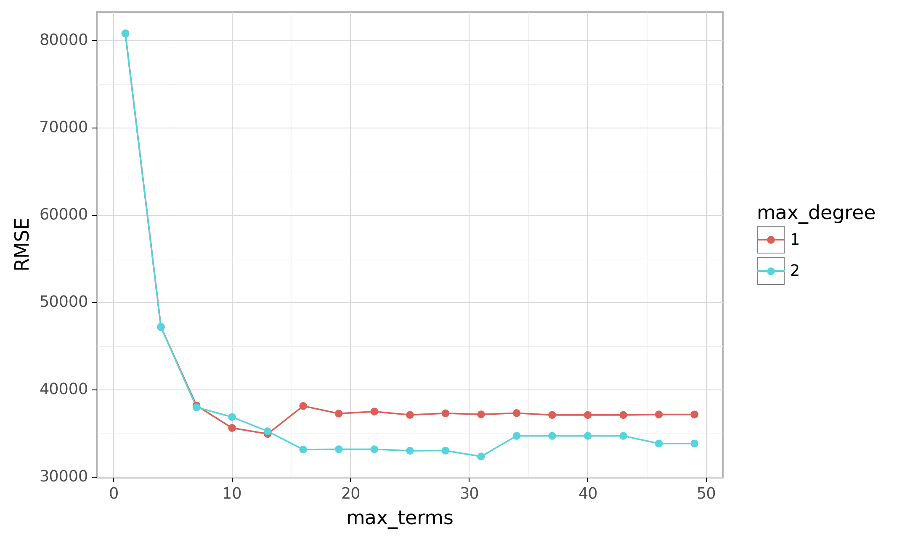
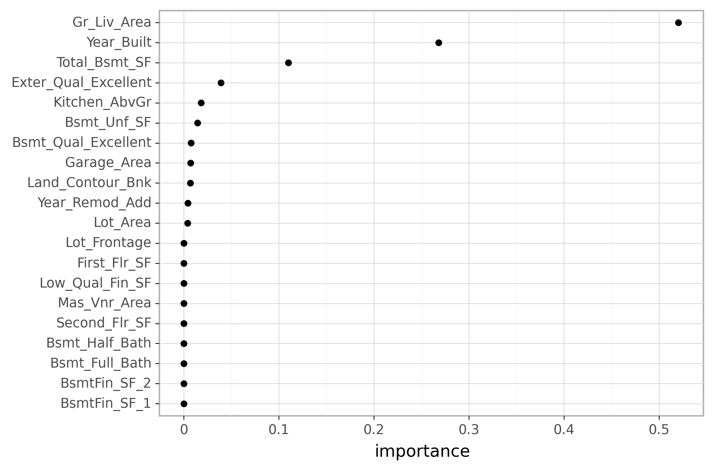
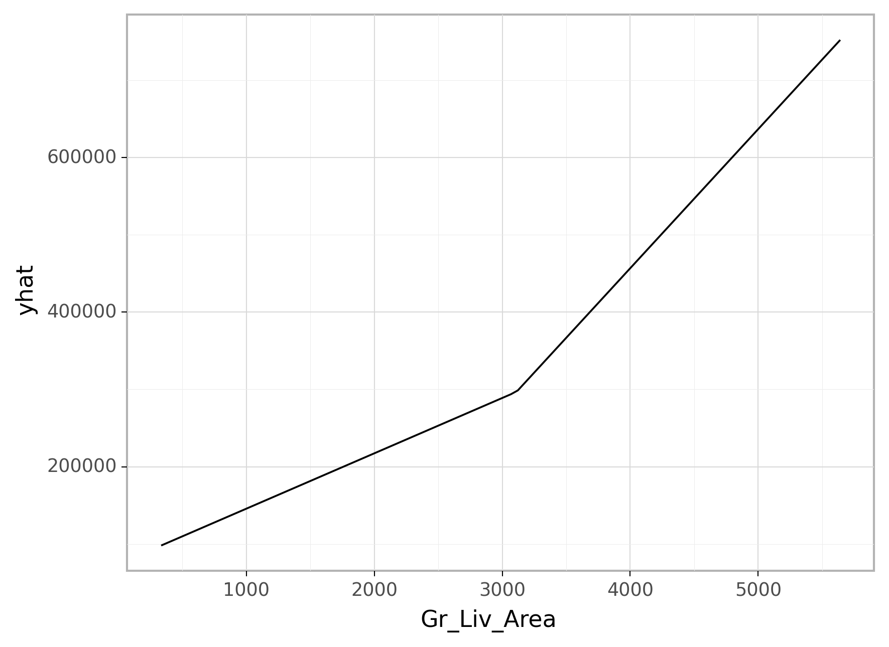

<br>

```{r setup, include=FALSE}

# Set global knitr chunk options
knitr::opts_chunk$set(echo = TRUE, warning = FALSE, message = FALSE, 
                      collapse = TRUE, fig.align = 'center')

library(reticulate)
use_virtualenv("/Users/b294776/Desktop/Workspace/Projects/misk/misk-homl/venv", required = TRUE)

# Set the graphical theme
ggplot2::theme_set(ggplot2::theme_light())
```

```{python, echo = FALSE}
import plotnine
plotnine.themes.theme_set(new=plotnine.themes.theme_light())
```

The previous modules discussed algorithms that are intrinsically linear. Many of these models can be adapted to nonlinear patterns in the data by manually adding nonlinear model terms (e.g., squared terms, interaction effects, and other transformations of the original features); however, to do so you the analyst must know the specific nature of the nonlinearities and interactions _a priori_.  Alternatively, there are numerous algorithms that are inherently nonlinear. When using these models, the exact form of the nonlinearity does not need to be known explicitly or specified prior to model training. Rather, these algorithms will search for, and discover, nonlinearities and interactions in the data that help maximize predictive accuracy. 

This module discusses _multivariate adaptive regression splines_ (MARS) [@friedman1991multivariate], an algorithm that automatically creates a piecewise linear model which provides an intuitive stepping block into nonlinearity after grasping the concept of multiple linear regression. Future modules will focus on other nonlinear algorithms.

# Learning objectives

By the end of this module you will know how:

- MARS models incorporates non-linear relationships with hinge functions (aka "knots").
- How to train and tune MARS models using R and/or Python.
- How to identify and visualize the most influential features in MARS models.

# Prerequisites {.tabset}


## `r fontawesome::fa("python")` 

```{python}
# Helper packages
import numpy as np
import pandas as pd
from plotnine import *

# Modeling packages
from pyearth import Earth
from sklearn.model_selection import train_test_split
from sklearn.preprocessing import OneHotEncoder
from sklearn.compose import ColumnTransformer
from sklearn.compose import make_column_selector as selector
from sklearn.model_selection import GridSearchCV
from sklearn.model_selection import KFold
from sklearn.inspection import partial_dependence
```

```{python}
# Ames housing data
ames = pd.read_csv("data/ames.csv")

# create train/test split
train, test = train_test_split(ames, train_size=0.7, random_state=123)

# separate features from labels and only use numeric features
X_train = train.drop("Sale_Price", axis=1)
y_train = train[["Sale_Price"]]
```

## `r fontawesome::fa("r-project")` 

```{r}
# Helper packages
library(tidyverse)   # for data wrangling & plotting

# Modeling packages
library(tidymodels)  # for fitting MARS models

# Model interpretability packages
library(vip)         # for variable importance
library(pdp)         # for variable relationships
```

```{r MARS-ames-train}
# Stratified sampling with the rsample package
set.seed(123)
ames <- AmesHousing::make_ames()
split  <- rsample::initial_split(ames, prop = 0.7, strata = "Sale_Price")
ames_train  <- rsample::training(split)
ames_test   <- rsample::testing(split)
```

# The basic idea

In the previous modules, we focused on linear models (where the analyst has to explicitly specify any nonlinear relationships and interaction effects). We illustrated some of the advantages of linear models such as their ease and speed of computation and also the intuitive nature of interpreting their coefficients.  However, linear models make a strong assumption about linearity, and this assumption is often a poor one, which can affect predictive accuracy.

We can extend linear models to capture any non-linear relationship. Typically, this is done by explicitly including polynomial terms (e.g., $x_i^2$) or step functions.  Polynomial regression is a form of regression in which the relationship between $X$ and $Y$ is modeled as a $d$th degree polynomial in $X$.  For example, the following equation represents a polynomial regression function where $Y$ is modeled as a $d$-th degree polynomial in $X$.  Generally speaking, it is unusual to use $d$ greater than 3 or 4 as the larger $d$ becomes, the easier the function fit becomes overly flexible and oddly shaped...especially near the boundaries of the range of $X$ values. Increasing $d$ also tends to increase the presence of multicollinearity.

\begin{equation}
  y_i = \beta_0 + \beta_1 x_i + \beta_2 x^2_i + \beta_3 x^3_i \dots + \beta_d x^d_i + \epsilon_i,
\end{equation}

An alternative to polynomials is to use step functions. Whereas polynomial functions impose a global non-linear relationship, step functions break the range of $X$ into bins, and fit a simple constant (e.g., the mean response) in each. This amounts to converting a continuous feature into an ordered categorical variable such that our linear regression function is converted to the following equation

\begin{equation}
  y_i = \beta_0 + \beta_1 C_1(x_i) + \beta_2 C_2(x_i) + \beta_3 C_3(x_i) \dots + \beta_d C_d(x_i) + \epsilon_i,
\end{equation}

where $C_1(x_i)$ represents $x_i$ values ranging from $c_1 \leq x_i < c_2$, $C_2\left(x_i\right)$ represents $x_i$ values ranging from $c_2 \leq x_i < c_3$, $\dots$, $C_d\left(x_i\right)$ represents $x_i$ values ranging from $c_{d-1} \leq x_i < c_d$.  The figure below contrasts linear, polynomial, and step function fits for non-linear, non-monotonic simulated data.


```{r nonlinear-comparisons, echo=FALSE, fig.height=6, fig.width=8, fig.cap="Figure: Blue line represents predicted (`y`) values as a function of `x` for alternative approaches to modeling explicit nonlinear regression patterns. (A) Traditional linear regression approach does not capture any nonlinearity unless the predictor or response is transformed (i.e. log transformation). (B) Degree-2 polynomial, (C) Degree-3 polynomial, (D) Step function cutting `x` into six categorical levels."}
set.seed(123)  # for reproducibility
x <- seq(from = 0, to = 2 * pi, length = 500)
y <- sin(x) + rnorm(length(x), sd = 0.3)
df <- data.frame(x, y) %>%
  filter(x < 6)

p1 <- ggplot(df, aes(x, y)) +
  geom_point(size = 1, alpha = .2) +
  geom_smooth(method = "lm", se = FALSE) +
  ggtitle("(A) Assumed linear relationship")

p2 <- ggplot(df, aes(x, y)) +
  geom_point(size = 1, alpha = .2) +
  stat_smooth( method = "lm", se = FALSE, formula = y ~ poly(x, 2, raw = TRUE)) +
  ggtitle("(B) Degree-2 polynomial regression")

p3 <- ggplot(df, aes(x, y)) +
  geom_point(size = 1, alpha = .2) +
  stat_smooth( method = "lm", se = FALSE, formula = y ~ poly(x, 3, raw = TRUE)) +
  ggtitle("(C) Degree-3 polynomial regression")

# fit step function model (6 steps)
step_fit <- lm(y ~ cut(x, 5), data = df)
step_pred <- predict(step_fit, df)

p4 <- ggplot(cbind(df, step_pred), aes(x, y)) +
  geom_point(size = 1, alpha = .2) +
  geom_line(aes(y = step_pred), size = 1, color = "blue") +
  ggtitle("(D) Step function regression")

gridExtra::grid.arrange(p1, p2, p3, p4, nrow = 2)
```

Although useful, the typical implementation of polynomial regression and step functions require the user to explicitly identify and incorporate which variables should have what specific degree of interaction or at what points of a variable $X$ should cut points be made for the step functions.  Considering many data sets today can easily contain 50, 100, or more features, this would require an enormous and unnecessary time commitment from an analyst to determine these explicit non-linear settings.

## Multivariate adaptive regression splines

Multivariate adaptive regression splines (MARS) provide a convenient approach to capture the nonlinear relationships in the data by assessing cutpoints (_knots_) similar to step functions.  The procedure assesses each data point for each predictor as a knot and creates a linear regression model with the candidate feature(s).  For example, consider our non-linear, non-monotonic data above where $Y = f\left(X\right)$. The MARS procedure will first look for the single point across the range of `X` values where two different linear relationships between `Y` and `X` achieve the smallest error (e.g., smallest SSE).  What results is known as a hinge function $h\left(x-a\right)$, where $a$ is the cutpoint value. For a single knot (Figure (A)), our hinge function is $h\left(\text{x}-1.183606\right)$ such that our two linear models for `Y` are

\begin{equation}
  \text{y} = 
  \begin{cases}
    \beta_0 + \beta_1(1.183606 - \text{x}) & \text{x} < 1.183606, \\
    \beta_0 + \beta_1(\text{x} - 1.183606) & \text{x} > 1.183606
  \end{cases}
\end{equation}

Once the first knot has been found, the search continues for a second knot which is found at $x = 4.898114$ (plot B in figure below).  This results in three linear models for `y`:

\begin{equation}
  \text{y} = 
  \begin{cases}
    \beta_0 + \beta_1(1.183606 - \text{x}) & \text{x} < 1.183606, \\
    \beta_0 + \beta_1(\text{x} - 1.183606) & \text{x} > 1.183606 \quad \& \quad \text{x} < 4.898114, \\
    \beta_0 + \beta_1(4.898114 - \text{x}) & \text{x} > 4.898114
  \end{cases}
\end{equation}

```{r examples-of-multiple-knots, echo=FALSE, fig.height=6, fig.width=8, fig.cap="Figure: Examples of fitted regression splines of one (A), two (B), three (C), and four (D) knots."}
# one knot
mars1 <- mda::mars(df$x, df$y, nk = 3, prune = FALSE)
p1 <- df %>%
  mutate(predicted = as.vector(mars1$fitted.values)) %>%
  ggplot(aes(x, y)) +
  geom_point(size = 1, alpha = .2) +
  geom_line(aes(y = predicted), size = 1, color = "blue") +
  ggtitle("(A) One knot")

# two knots
mars2 <- mda::mars(df$x, df$y, nk = 5, prune = FALSE)
p2 <- df %>%
  mutate(predicted = as.vector(mars2$fitted.values)) %>%
  ggplot(aes(x, y)) +
  geom_point(size = 1, alpha = .2) +
  geom_line(aes(y = predicted), size = 1, color = "blue") +
  ggtitle("(B) Two knots")

mars3 <- mda::mars(df$x, df$y, nk = 7, prune = FALSE)
p3 <- df %>%
  mutate(predicted = as.vector(mars3$fitted.values)) %>%
  ggplot(aes(x, y)) +
  geom_point(size = 1, alpha = .2) +
  geom_line(aes(y = predicted), size = 1, color = "blue") +
  ggtitle("(C) Three knots")

mars4 <- mda::mars(df$x, df$y, nk = 9, prune = FALSE)
p4 <- df %>%
  mutate(predicted = as.vector(mars4$fitted.values)) %>%
  ggplot(aes(x, y)) +
  geom_point(size = 1, alpha = .2) +
  geom_line(aes(y = predicted), size = 1, color = "blue") +
  ggtitle("(D) Four knots")


gridExtra::grid.arrange(p1, p2, p3, p4, nrow = 2)
```

This procedure continues until many knots are found, producing a (potentially) highly non-linear prediction equation.  Although including many knots may allow us to fit a really good relationship with our training data, it may not generalize very well to new, unseen data. Consequently, once the full set of knots has been identified, we can sequentially remove knots that do not contribute significantly to predictive accuracy.  This process is known as "pruning" and we can use cross-validation, as we have with the previous models, to find the optimal number of knots.

# Fitting a MARS model

## Fitting a basic model {.tabset}

We'll start by fitting a basic model using `Gr_Liv_Area` and `Year_Built` to predict our `Sales_Price`. In both R and Python, the modeling algorithm will assess all potential knots across all supplied features and then will prune to the optimal number of knots based on an expected change in $R^2$ (for the training data) of less than 0.001.  This calculation is performed by the Generalized cross-validation (GCV)  procedure, which is a computational shortcut for linear models that produces an approximate leave-one-out cross-validation error metric [@golub1979generalized].  

```{block, type='note'}
Note that MARS models do not require normalization or standardization of numeric features.
```


In both languages, the GCV is reported along with other metrics ($R^2$, residual sum of squares (R) and MSE (Python)). We can use this info to compute the RMSE, which is in the low to mid \$40K range. Keep in mind that this RMSE is not a cross-validated RMSE, just the RMSe on the training data (we'll do some cross-validation shortly). 

You'll notice that in both the R and Python examples we see a knot in `Gr_Liv_Area` at about 3500 (3395 in R and 3500 in Python). This suggests that as homes exceed 3500 square feet there is a change in the linear relationship between `Gr_Liv_Area` and `Sale_Price` compared to homes that are less than 3500 square feet. In both cases we see multiple knots across the range of `Gr_Liv_Area` and `Year_Built`. in fact, our model has taken two features (`Gr_Liv_Area` and `Year_Built`) and split them into 8-10 features (8 in R and 10 in Python) by creating knots along these feature values.

```{block, type="tip"}
The most important tuning parameter in a MARS model is the number of knots to use for a given feature. However, this is automatically baked into the algorithm so we get this tuning for free!
```


```{block, type="note"}
The term "MARS" is trademarked and licensed exclusively to Salford Systems: https://www.salford-systems.com. We can use MARS as an abbreviation; however, it cannot be used for competing software solutions.  This is why the R and Python packages use the name **earth**.
```

### `r fontawesome::fa("python")` 

In Python we use the `Earth()` model provided by the [pyearth](https://contrib.scikit-learn.org/py-earth/) library. pyearth is one of many packages that are considered scikit-learn compatible "plug-in" packages. You can read more about these compatible plug-in packages [here](https://github.com/scikit-learn-contrib/scikit-learn-contrib).

```{python}
# Step 1: create model object
earth_mod = Earth()

# Step 2: fit/train model
earth_fit = earth_mod.fit(X_train[["Gr_Liv_Area", "Year_Built"]], y_train)

# Step 3: results
print(earth_fit.summary())
```

```{python}
# RMSE
np.sqrt(earth_fit.mse_)
```


### `r fontawesome::fa("r-project")` 

In R, we use the `parsnip::mars()` function which provides a default setting of using the `earth` package, which is the most popular package for MARS functionality in R.

```{r}
# Step 1: create ridge model object
mars_mod <- mars(mode = "regression")

# Step 2: create model & preprocessing recipe
model_recipe <- recipe(
    Sale_Price ~ Gr_Liv_Area + Year_Built, 
    data = ames_train
  )
  
# Step 3: fit model workflow
mars_fit <- workflow() %>%
  add_recipe(model_recipe) %>%
  add_model(mars_mod) %>%
  fit(data = ames_train)

# Step 4: results
mars_fit
```

```{r}
# RMSE
sqrt(mars_fit$fit$fit$fit$rss / nrow(ames_train))
```

```{r}
# coefficients
mars_fit$fit$fit$fit$coefficients
```


## Fitting a full model {.tabset}

Next, lets go ahead and fit a full model to include all Ames housing features. As you'll see in the results we experience significant improvement in the RMSE (low to mid \$20K for both R and Python).  However, recall that this is not a cross-validated RMSE, but rather the RMSE for the training data in which the model was fit. Consequently, this is likely an overfit model but we'll perform a cross-validation approach in the next section to get a more accurate generalized RMSE.

MARS models are no different then other algorithms where we need to convert categorical features to numeric values. This can be handled differently in R and Python but in the examples that follow the categorical features are one-hot encoded. This leads to over 300 features in our dataset; however, when you look at the results you will see that only a fraction of these features are used in the trained model (Python uses 17 and R uses 29). However, there will actually be more coefficients then the features used because of the knots. For example of the 17 features used by Python, 27 coefficients are developed since many of these features are used multiple times (i.e. `h(Gr_Liv_Area-3112)`, `h(3112-Gr_Liv_Area)`).

```{block, type='note'}
We call this process of feature elimination and knot refinement as "pruning the knots".
```


### `r fontawesome::fa("python")` 

In Python we must convert our categorical features to numeric values. For this example we'll simply dummy encode them using Pandas `get_dummies()`.

```{python}
# create new feature set with encoded features
X_train_encoded = pd.get_dummies(X_train)
```


```{python}
# create model object
earth_mod = Earth()

# fit/train model
earth_fit_full = earth_mod.fit(X_train_encoded, y_train)

# results
print(earth_fit_full.summary())
```

```{python}
# RMSE
np.sqrt(earth_fit_full.mse_)
```


### `r fontawesome::fa("r-project")` 

In R, the MARS modeling engine "earth" will automatically one-hot encode all categorical features.

```{r}
# Step 1: create ridge model object
mars_mod <- mars(mode = "regression")

# Step 2: create model & preprocessing recipe
model_recipe <- recipe(
    Sale_Price ~ ., 
    data = ames_train
  )
  
# Step 3: fit model workflow
mars_fit <- workflow() %>%
  add_recipe(model_recipe) %>%
  add_model(mars_mod) %>%
  fit(data = ames_train)

# Step 4: results
mars_fit
```

```{r}
# RMSE
sqrt(mars_fit$fit$fit$fit$rss / nrow(ames_train))
```


## Fitting a full model with interactions {.tabset}

In addition to pruning the number of knots, MARS models allow us to also assess potential interactions between different hinge functions. The following example illustrates by allowing second degree interactions. You can see that now our model includes interaction terms between a maximum of two hinge functions (e.g. in the Python results you see `h(Bsmt_Unf_SF-1065)*h(3112-Gr_Liv_Area)` which represents an interaction effect for those houses with more than 1,065 unfinished basement square footage but less than 3,112 above ground living space).

### `r fontawesome::fa("python")` 

```{python}
# create model object
earth_mod = Earth(max_degree=2)

# fit/train model
earth_fit_int = earth_mod.fit(X_train_encoded, y_train)

# results
print(earth_fit_int.summary())
```

### `r fontawesome::fa("r-project")` 

```{r}
# create ridge model object
mars_mod <- mars(mode = "regression", prod_degree = 2)

# create model & preprocessing recipe
model_recipe <- recipe(
    Sale_Price ~ ., 
    data = ames_train
  )
  
# fit model workflow
mars_fit <- workflow() %>%
  add_recipe(model_recipe) %>%
  add_model(mars_mod) %>%
  fit(data = ames_train)

# coefficients
mars_fit$fit$fit$fit$coefficients
```

# Tuning {.tabset}

There are two important tuning parameters associated with MARS models: the maximum degree of interactions and the number of terms retained in the final model. We need to perform a grid search to identify the optimal combination of these hyperparameters that minimize prediction error (the above pruning process was based only on an approximation of CV model performance on the training data rather than an exact _k_-fold CV process). As in previous modules, we'll perform a CV grid search to identify the optimal hyperparameter mix.  Below, we set up a grid that assesses different combinations of interaction complexity and the number of terms to retain in the final model.

```{block, type='warning'}
Rarely is there any benefit in assessing greater than 3-rd degree interactions. Also, realize that tuning MARS models can become computationally intense. Its often beneficial to start with 10 evenly spaced values for the maximum terms and then you can always zoom in to a region once you find an approximate optimal solution.
```

In the examples that follow we see that the optimal models in both R and Python include 2 degree interactions and both are optimized by allowing around 30 terms. 

## `r fontawesome::fa("python")` 

In Python, our hyperparameters are `max_terms` (maximum terms retained in the model) and `max_degrees` (maximum degree of interaction allowed).

```{python}
# create model object
earth_mod = Earth()

# define loss function
loss = 'neg_root_mean_squared_error'

# create 5 fold CV object
kfold = KFold(n_splits=5, random_state=123, shuffle=True)

# Create grid of hyperparameter values
hyper_grid = {'max_terms': range(1, 51, 3),
              'max_degree': range(1, 3)}
```

```{python}
grid_search = GridSearchCV(earth_mod, hyper_grid, cv=kfold, scoring=loss)
results = grid_search.fit(X_train_encoded, y_train)

# Optimal penalty parameter in grid search
results.best_estimator_
```

```{python}
# Best model's cross validated RMSE
round(abs(results.best_score_), 2)
```

```{python, eval=FALSE}
results_df = pd.DataFrame(results.cv_results_.get("params"))
results_df['RMSE'] = np.abs(results.cv_results_.get("mean_test_score"))
results_df['max_degree'] = results_df['max_degree'].astype(str)

(ggplot(results_df, aes('max_terms', 'RMSE', color='max_degree'))
  + geom_line()
  + geom_point()
  )
```

```{python py-mars-grid-search-results-output, echo=FALSE}
results_df = pd.DataFrame(results.cv_results_.get("params"))
results_df['RMSE'] = np.abs(results.cv_results_.get("mean_test_score"))
results_df['max_degree'] = results_df['max_degree'].astype(str)

p = (ggplot(results_df, aes('max_terms', 'RMSE', color='max_degree'))
  + geom_line()
  + geom_point()
  )
 
p.save(filename="py-mars-grid-search-results.png", path = "./images", dpi = 300, verbose = False)
```

```{r, echo=FALSE, fig.align='center', out.width="90%"}

```


## `r fontawesome::fa("r-project")` 

In R, our hyperparameters are `num_terms` (number of terms retained in the model) and `prod_degrees` (maximum degree of interaction allowed). Note that in R we can use `num_terms()` and `prod_degree()` from the dials package to create a tuning grid. By default `prod_degree()` will use values of 1 and 2 (no interactions and 2 degree interactions).

```{r, cache=TRUE}
# create ridge model object
mars_mod <- mars(mode = "regression", num_terms = tune(), prod_degree = tune()) %>%
 set_engine("earth")

# create model & preprocessing recipe
model_recipe <- recipe(
    Sale_Price ~ ., 
    data = ames_train
  )
  
# create k-fold cross validation object
folds <- vfold_cv(ames_train, v = 5)

# create our model recipe
model_recipe <- recipe(Sale_Price ~ ., data = ames_train)

# create a hyper parameter tuning grid
hyper_grid <- grid_regular(
 num_terms(range = c(1, 100)), 
 prod_degree(),
 levels = 50
 )

# train our model across the hyper parameter grid
set.seed(123)
results <- tune_grid(mars_mod, model_recipe, resamples = folds, grid = hyper_grid)

# get best results
show_best(results, metric = "rmse")
```

```{r}
autoplot(results)
```


# Feature interpretation {.tabset}

MARS models use a backwards elimination feature selection routine that looks at reductions in the GCV estimate of error as each predictor is added to the model. This total reduction can be used as the variable importance measure (`"gcv"`). Since MARS will automatically include and exclude terms during the pruning process, it essentially performs automated feature selection. If a predictor was never used in any of the MARS basis functions in the final model (after pruning), it has an importance value of zero.   Alternatively, you can also monitor the change in the residual sums of squares (RSS) as terms are added (`"rss"`); however, you will often see very little difference between these methods. The following examples extract the feature importance values based on RSS.

In both the R and Python examples we see very similar features as our most influential features (i.e. `Gr_Liv_Area`, `Year_Built`, `Total_Bsmt_SF`). We can then use [partial dependence plots](https://christophm.github.io/interpretable-ml-book/pdp.html) (PDPs) to plot the change in the average predicted value ($\hat{y}$) as specified feature(s) vary over their marginal distribution. This essentially illustrates how our model predicts an output based on changes in a given feature. The examples that follow plot the PDP of `Gr_Liv_Area`.

## `r fontawesome::fa("python")` 

In Python, after we identify the model that performs best in our cross-validation procedure, we can re-train our model with those parameters and use `feature_importance_type='rss'` to have our model record feature importance values.  We can then extract this info and plot the most influential features.

```{python, eval=FALSE}
best_mod = Earth(max_degree=2, max_terms=31, feature_importance_type='rss')
best_mod_fit = best_mod.fit(X_train_encoded, y_train)

vi = pd.DataFrame({'feature': best_mod_fit.xlabels_,
              'importance': best_mod_fit.feature_importances_})

# get top 20 influential features
top_20_features = vi.nlargest(20, 'importance')

# plot feature importance
(ggplot(top_20_features, aes(x='importance', y='reorder(feature, importance)'))
 + geom_point()
 + labs(y=None))
```

```{python py-vip-output, echo=FALSE}
best_mod = Earth(max_degree=2, max_terms=31, feature_importance_type='rss')
best_mod_fit = best_mod.fit(X_train_encoded, y_train)

vi = pd.DataFrame({'feature': best_mod_fit.xlabels_,
              'importance': best_mod_fit.feature_importances_})

# get top 20 influential features
top_20_features = vi.nlargest(20, 'importance')

# plot feature importance
p = (ggplot(top_20_features, aes(x='importance', y='reorder(feature, importance)'))
 + geom_point()
 + labs(y=None))
 
p.save(filename="py-mars-vip-output.png", path = "./images", dpi = 300, verbose = False)
```

```{r, echo=FALSE, fig.align='center', out.width="90%"}

```

We can then plot how our most influential features influence the predicted values. Here, you will notice that as `Gr_Liv_Area` exceeds 3,000 square feet it has a stronger linear impact to our predicted `Sales_Price`. Note that `partial_dependence()` will automatically trim off the extreme values in our training data. If you supply `percentiles=(0, 1)` as below it will use all values in the training data.

```{python, eval=FALSE}
pd_results = partial_dependence(
  best_mod_fit, X_train_encoded, "Gr_Liv_Area", kind='average',
  percentiles=(0, 1)) 
  
pd_output = pd.DataFrame({'Gr_Liv_Area': pd_results['values'][0],
                          'yhat': pd_results['average'][0]})
                          
(ggplot(pd_output, aes('Gr_Liv_Area', 'yhat'))
  + geom_line())
```

```{python py-pdp-output, echo=FALSE}
pd_results = partial_dependence(
  best_mod_fit, X_train_encoded, "Gr_Liv_Area", kind='average',
  percentiles=(0, 1)) 
  
pd_output = pd.DataFrame({'Gr_Liv_Area': pd_results['values'][0],
                          'yhat': pd_results['average'][0]})
                          
p = (ggplot(pd_output, aes('Gr_Liv_Area', 'yhat'))
  + geom_line())
 
p.save(filename="py-mars-pdp-output.png", path = "./images", dpi = 300, verbose = False)
```

```{r, echo=FALSE, fig.align='center', out.width="90%"}

```

## `r fontawesome::fa("r-project")` 

In R we can use the `vip` package to extract our top 20 most important features based on the RSS measure. 

```{r}
# identify best model
lowest_rmse <- results %>%
  select_best("rmse")

# extract best model and fit
final_model <- finalize_workflow(
  workflow() %>% add_recipe(model_recipe) %>% add_model(mars_mod), 
  lowest_rmse) %>%
  fit(ames_train)

# plot top 20 influential variables
final_model %>%
  pull_workflow_fit() %>% 
  vip(20, type = "rss")
```

We can then use the [`pdp`](https://bgreenwell.github.io/pdp/index.html) package to extract the partial dependence  values in order to plot. Note that for tidyverse models we need to create the custom prediction function to pass into `pdp::parital()`.

```{r}
# prediction function
pdp_pred_fun <- function(object, newdata) {
  mean(predict(object, newdata, type = "numeric")$.pred)
}

# use the pdp package to extract partial dependence predictions
# and then plot
final_model %>%
  pdp::partial(
   pred.var = "Gr_Liv_Area", 
   pred.fun = pdp_pred_fun,
   grid.resolution = 10, 
   train = ames_train
  ) %>%
  ggplot(aes(Gr_Liv_Area, yhat)) +
  geom_line() +
  scale_y_continuous(labels = scales::dollar)
```


# Final thoughts

There are several advantages to MARS.  First, MARS naturally handles mixed types of predictors (quantitative and qualitative). MARS considers all possible binary partitions of the categories for a qualitative predictor into two groups.^[This is very similar to CART-like decision trees which you'll be exposed to in a later module.] Each group then generates a pair of piecewise indicator functions for the two categories. MARS also requires minimal feature engineering (e.g., feature scaling) and performs automated feature selection. For example, since MARS scans each predictor to identify a split that improves predictive accuracy, non-informative features will not be chosen. Furthermore, highly correlated predictors do not impede predictive accuracy as much as they do with OLS models. 

However, one disadvantage to MARS models is that they're typically slower to train.  Since the algorithm scans each value of each predictor for potential cutpoints, computational performance can suffer as both $n$ and $p$ increase.  Also, although correlated predictors do not necessarily impede model performance, they can make model interpretation difficult. When two features are nearly perfectly correlated, the algorithm will essentially select the first one it happens to come across when scanning the features.  Then, since it randomly selected one, the correlated feature will likely not be included as it adds no additional explanatory power.

# Exercises

Using the `hitters` dataset:

1. Apply a MARS model with all features.
2. How does the model performance compare to your previous models?
3. How many of the features are influential? Which 10 features are considered most influential?
4. Does your model include hinge functions? If so, explain their coefficient and plot their impact on the predicted response variable.
5. Does your model include interactions? If so, pick the interaction effect that is most influential and explain the coefficient.

[🏠](https://github.com/misk-data-science/misk-homl)

# References
