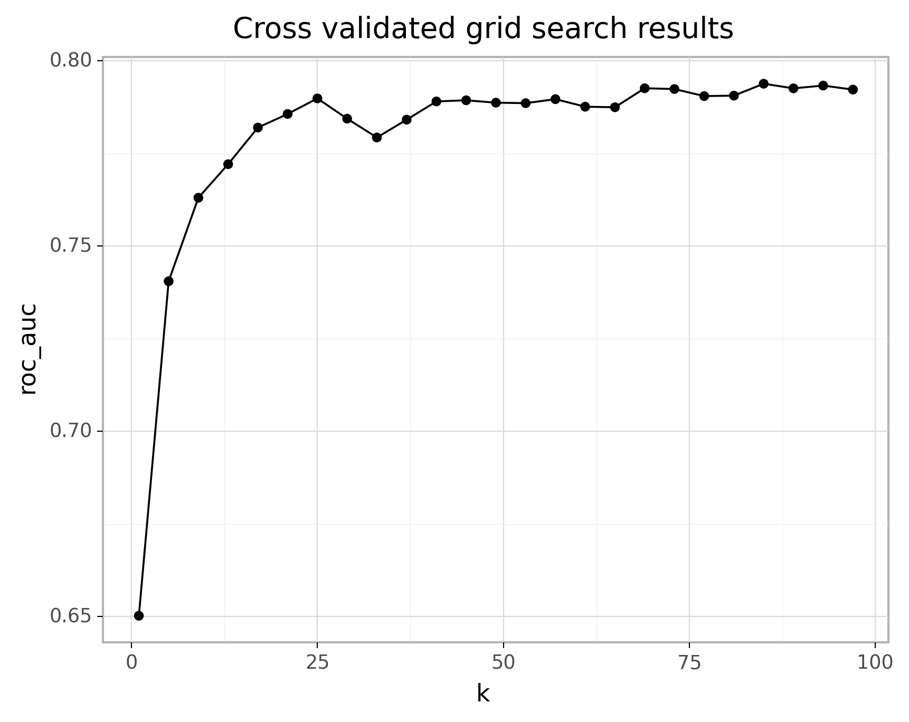
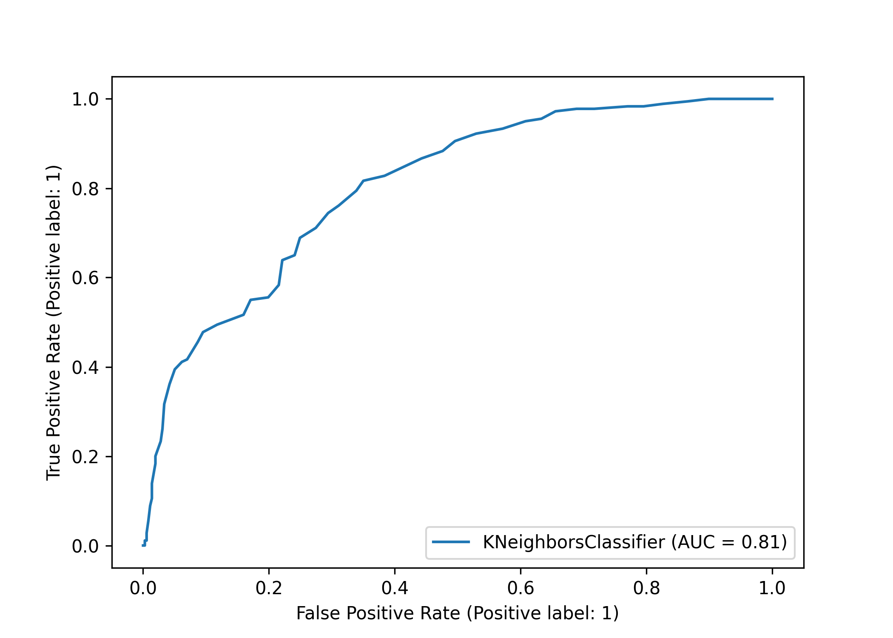
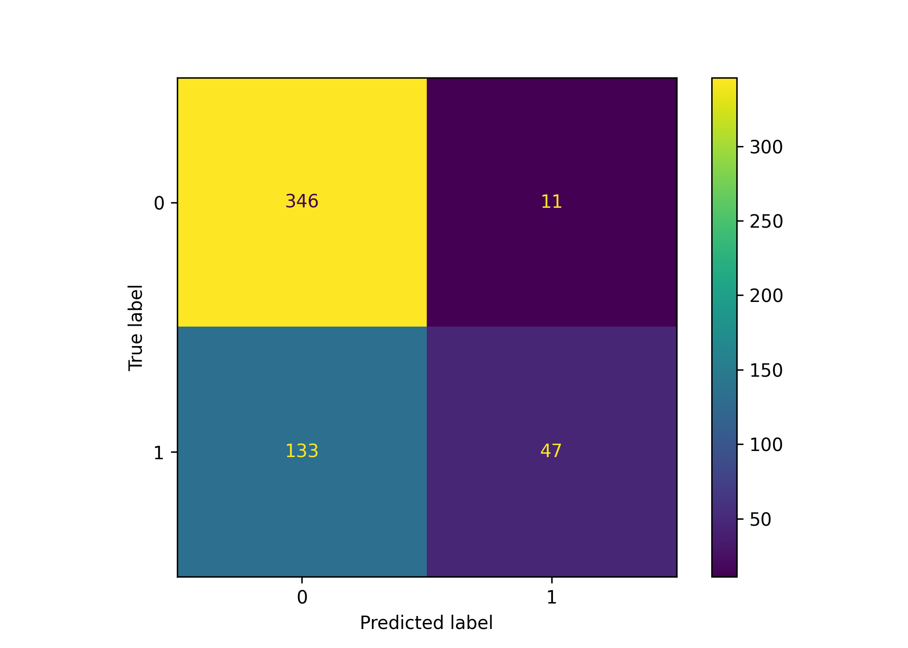
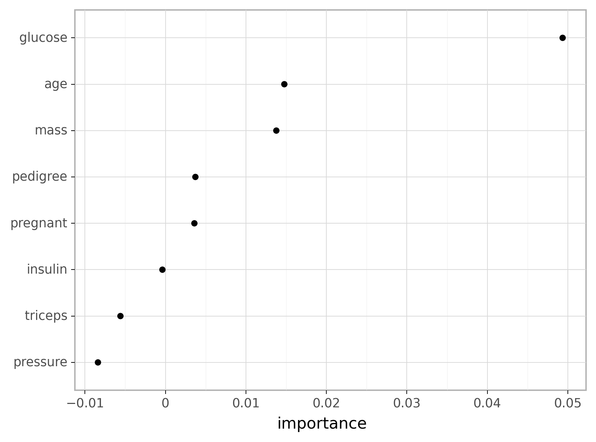
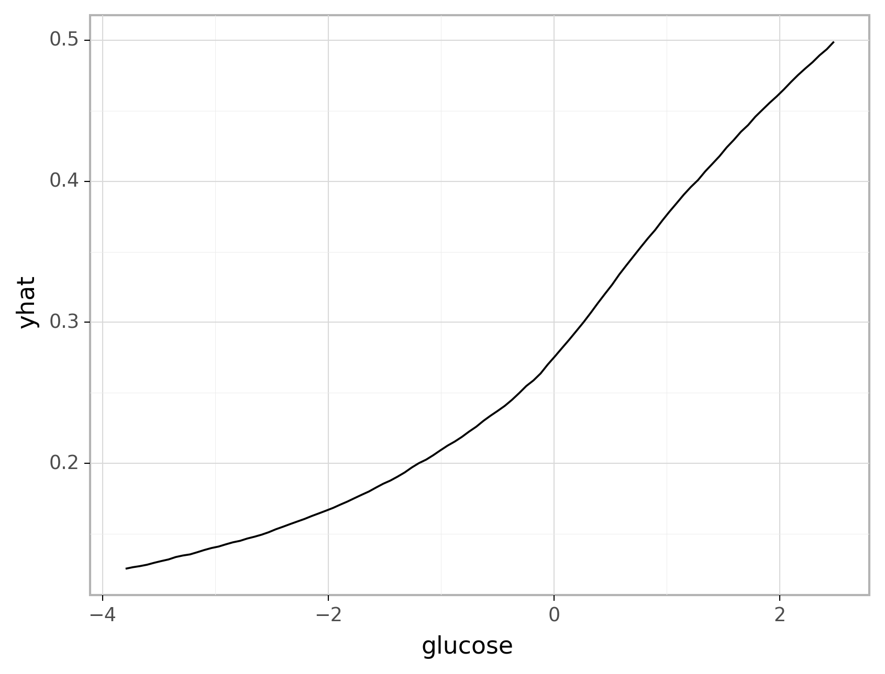

<br>

```{r setup, include=FALSE}

# Set global knitr chunk options
knitr::opts_chunk$set(echo = TRUE, warning = FALSE, message = FALSE, 
                      collapse = TRUE, fig.align = 'center')

library(reticulate)
use_virtualenv("/Users/b294776/Desktop/Workspace/Projects/misk/misk-homl/venv", required = TRUE)

# Set the graphical theme
ggplot2::theme_set(ggplot2::theme_light())

# hidden requirements
ames <- AmesHousing::make_ames()
```

```{python, echo = FALSE}
import plotnine
plotnine.themes.theme_set(new=plotnine.themes.theme_light())
```

_K_-nearest neighbor (KNN) is a very simple algorithm in which each observation is predicted based on its "similarity" to other observations. Unlike most methods in this course, KNN is a _memory-based_ algorithm and cannot be summarized by a closed-form model. This means the training samples are required at run-time and predictions are made directly from the sample relationships. Consequently, KNNs are also known as _lazy learners_ [@cunningham2007k] and can be computationally inefficient.  However, KNNs have been successful in a large number of business problems (see, for example, @jiang2012improved and @mccord2011spam) and are useful for preprocessing purposes as well (as was discussed in the [imputation section of the feature engineering modeul](https://misk-data-science.github.io/misk-homl/docs/notebooks/03-engineering.html#K-nearest_neighbor)).

# Learning objectives

By the end of this module you will know how to:

- Prepare your data for KNN models.
- Train, fit, tune and assess KNN model performance.
- Identify important features and visualize their influence on the response.

# Prerequisites {.tabset}

Since we already saw an example of KNN models with the Ames housing data in the modeling process and feature engineering modules, this module will illustrate the implementation procedures with the Pima diabetes data.

## `r fontawesome::fa("python")` 

```{python}
# Helper packages
import numpy as np
import pandas as pd
import matplotlib.pyplot as plt
from plotnine import *

# Modeling packages
from sklearn.model_selection import train_test_split
from sklearn.model_selection import KFold
from sklearn.model_selection import cross_val_score
from sklearn.model_selection import GridSearchCV
from sklearn.preprocessing import StandardScaler
from sklearn.neighbors import KNeighborsClassifier
from sklearn.metrics import plot_roc_curve
from sklearn.metrics import confusion_matrix
from sklearn.metrics import ConfusionMatrixDisplay
from sklearn.metrics import classification_report
from sklearn.inspection import permutation_importance
from sklearn.inspection import partial_dependence
```

```{python}
# diabetes data
pima = pd.read_csv("data/pima.csv")

# recode response variable to 1/0
pima = pima.replace({"diabetes": {"pos": 1, "neg": 0}})

# create train/test split
train, test = train_test_split(pima, train_size=0.7, random_state=123)

# separate features from labels and only use numeric features
X_train = train.drop("diabetes", axis=1)
y_train = train[["diabetes"]].values.ravel()
```

## `r fontawesome::fa("r-project")` 

```{r}
# Helper packages
library(tidyverse)   # for data wrangling & plotting

# Modeling packages
library(tidymodels) 

# Model interpretability packages
library(vip)         # for variable importance
library(pdp)         # for variable relationships
```

```{r}
pima <- read_csv("data/pima.csv") %>% 
  mutate(diabetes = factor(diabetes, levels = c("pos", "neg")))

set.seed(123)
split  <- rsample::initial_split(pima, prop = 0.7, strata = "diabetes")
train  <- rsample::training(split)
test   <- rsample::testing(split)
```


# Measuring similarity

The KNN algorithm identifies $k$ observations that are "similar" or nearest to the new record being predicted and then uses the average response value (regression) or the most common class (classification) of those $k$ observations as the predicted output.  

For illustration, consider our Ames housing data.  In real estate, Realtors determine what price they will list (or market) a home for based on "comps" (comparable homes). To identify comps, they look for homes that have very similar attributes to the one being sold.  This can include similar features (e.g., square footage, number of rooms, and style of the home), location (e.g., neighborhood and school district), and many other attributes.  The Realtor will look at the typical sale price of these comps and will usually list the new home at a very similar price to the prices these comps sold for.

As an example, the figure below maps 10 homes (blue) that are most similar to the home of interest (red). These homes are all relatively close to the target home and likely have similar characteristics (e.g., home style, size, and school district). Consequently, the Realtor would likely list the target home around the average price that these comps sold for.  In essence, this is what the KNN algorithm will do.

```{r map-homes, echo=FALSE, fig.width=8, fig.height=5}
library(leaflet)

df <- recipe(Sale_Price ~ ., data = ames) %>%
  step_nzv(all_nominal()) %>%
  step_integer(matches("Qual|Cond|QC|Qu")) %>%
  step_center(all_numeric(), -all_outcomes()) %>%
  step_scale(all_numeric(), -all_outcomes()) %>%
  step_dummy(all_nominal(), -all_outcomes(), one_hot = TRUE) %>%
  prep(training = ames, retain = TRUE) %>%
  juice() %>%
  select(-Sale_Price)

home <- 11
k = 10
index <- as.vector(FNN::knnx.index(df[-home, ], df[home, ], k = k))
sale_home <- ames[home, ] %>%
  mutate(type = "target")
like_homes <- ames[index, ] %>%
  mutate(type = "like")
knn_homes <- rbind(sale_home, like_homes)

pal <- colorFactor(c("blue", "red"),
                   domain = unique(knn_homes$type))

knn_homes %>%
  filter(Neighborhood != "Stone_Brook") %>%
  leaflet() %>%
  addTiles() %>%
  addCircleMarkers(lng = ~Longitude,
                   lat = ~Latitude,
                   stroke = FALSE,
                   color = ~pal(type),
                   fillOpacity = .75
                   )
```

## Distance measures {#knn-distance}

How do we determine the similarity between observations (or homes as in the previous example)? We use distance (or dissimilarity) metrics to compute the pairwise differences between observations.  The most common distance measures are the Euclidean\index{euclidean distance} and Manhattan\index{manhattan distance} distance metrics; both of which measure the distance between observation $x_a$ and $x_b$ for all $j$ features.

\begin{equation}
 \text{Euclidean: }\sqrt{\sum^P_{j=1}(x_{aj} - x_{bj})^2}
\end{equation}

\begin{equation}
 \text{Manhattan: }\sum^P_{j=1} | x_{aj} - x_{bj} | 
\end{equation}

Euclidean distance is the most common and measures the straight-line distance between two samples (i.e., how the crow flies).  Manhattan measures the point-to-point travel time (i.e., city block) and is commonly used for binary predictors (e.g., one-hot encoded 0/1 indicator variables). A simplified example can be illustrated using the first two homes in our Ames housing data where we focus on only two features (`Gr_Liv_Area` & `Year_Built`). We can see these homes are similar with regards to the year built but have a sizable difference in square footage. 
  
```{r distance-btwn-two-houses, echo=FALSE}
two_houses <- ames[1:2, c("Gr_Liv_Area", "Year_Built")]

ames %>%
 slice(1:2) %>%
 mutate(Home = c('Home 1', 'Home 2')) %>%
 select(Home, Gr_Liv_Area, Year_Built) %>%
 kableExtra::kable(caption = "Square footage and year built for the first two homes in the Ames housing data.") %>%
 kableExtra::kable_styling()
```

The following plots illustrate the concept of how Euclidean distance is more concerned with the direct distance between two coordinates whereas Manhattan is more concerned with the cartesian direction.

```{r difference-btwn-distance-measures, echo=FALSE, fig.height=3, fig.cap="Euclidean (A) versus Manhattan (B) distance."}
p1 <- ggplot(two_houses, aes(Gr_Liv_Area, Year_Built)) +
  geom_point() +
  geom_line(lty = "dashed") +
  ggtitle("(A) Euclidean distance")
  

p2 <- ggplot(two_houses, aes(Gr_Liv_Area, Year_Built)) +
  geom_point() +
  geom_step(lty = "dashed") +
  ggtitle("(B) Manhattan distance")

gridExtra::grid.arrange(p1, p2, nrow = 1)
```

When we compute these distances we see that although similar, there is still a small difference in the computed similarity measurement. 

```{block, type="tip"}
When performing KNN it is always worth exploring different similarity differences to see how they influence the results for your analytic problem.
```


```{r, echo=FALSE}
# Euclidean
euc <- tibble(
 Distance = "Euclidean",
 Value = dist(two_houses, method = "euclidean")
)

# Manhattan
man <- tibble(
 Distance = "Manhattan",
 Value = dist(two_houses, method = "manhattan")
)

rbind(euc, man) %>%
 mutate(Value = round(Value, 2)) %>%
 kableExtra::kable(caption = "Distance measures for two homes based on square footage and year built.") %>%
 kableExtra::kable_styling()
```

There are other metrics to measure the distance between observations. For example, the Minkowski distance is a generalization of the Euclidean and Manhattan distances and is defined as

\begin{equation}
 \text{Minkowski: }\bigg( \sum^P_{j=1} | x_{aj} - x_{bj} | ^q \bigg)^{\frac{1}{q}},
\end{equation}

where $q > 0$ [@han2011data]. When $q = 2$ the Minkowski distance equals the Euclidean distance and when $q = 1$ it is equal to the Manhattan distance. The Mahalanobis distance is also an attractive measure to use since it accounts for the correlation between two variables [@de2000mahalanobis].

## Preprocessing

Due to the squaring in the Euclidean distance function, the Euclidean distance is more sensitive to outliers. Furthermore, most distance measures are sensitive to the scale of the features. Data with features that have different scales will bias the distance measures as those predictors with the largest values will contribute most to the distance between two samples.  For example, consider the three homes below: `home1` is a four bedroom built in 2008, `home2` is a two bedroom built in the same year, and `home3` is a three bedroom built a decade earlier.

```{r scale-impacts-distance-hidden, echo=FALSE}
home1 <- ames %>%
  mutate(id = row_number()) %>%
  select(Bedroom_AbvGr, Year_Built, id) %>%
  filter(Bedroom_AbvGr == 4 & Year_Built == 2008) %>%
  slice(1) %>%
  mutate(Home = "home1") %>%
  select(Home, everything())

home2 <- ames %>%
  mutate(id = row_number()) %>%
  select(Bedroom_AbvGr, Year_Built, id) %>%
  filter(Bedroom_AbvGr == 2 & Year_Built == 2008) %>%
  slice(1) %>%
  mutate(Home = "home2") %>%
  select(Home, everything())

home3 <- ames %>%
  mutate(id = row_number()) %>%
  select(Bedroom_AbvGr, Year_Built, id) %>%
  filter(Bedroom_AbvGr == 3 & Year_Built == 1998) %>%
  slice(1) %>%
  mutate(Home = "home3") %>%
  select(Home, everything())

rbind(home1, home2, home3) %>%
  kableExtra::kable(caption = "Number of bedrooms and the year built for three different homes.") %>%
  kableExtra::kable_styling()
```

The Euclidean distance between `home1` and `home3` is larger due to the larger difference in `Year_Built` with `home2`.  

```{r scale-impacts-distance2, echo=FALSE}
features <- c("Bedroom_AbvGr", "Year_Built")

# distance between home 1 and 2
home1_2 <- tibble(Euclidean = dist(rbind(home1[,features], home2[,features])))

# distance between home 1 and 3
home1_3 <- tibble(Euclidean = dist(rbind(home1[,features], home3[,features])))

rbind(home1_2, home1_3) %>%
 mutate(Distance_Between = c("Home 1 & 2", "Home 1 & 3")) %>%
 select(Distance_Between, Euclidean) %>%
 kableExtra::kable(caption = "Euclidean distance measure between home 1 and homes 2 & 3 based on raw feature values.") %>%
 kableExtra::kable_styling()
```

However, `Year_Built` has a much larger range (1875--2010) than `Bedroom_AbvGr` (0--8).  And if you ask most people, especially families with kids, the difference between 2 and 4 bedrooms is much more significant than a 10 year difference in the age of a home. If we standardize these features, we see that the difference between `home1` and `home2`'s standardized value for `Bedroom_AbvGr` is larger than the difference between `home1` and `home3`'s `Year_Built`.  

```{r scaling, echo=FALSE}
scaled_ames <- recipe(Sale_Price ~ ., ames) %>%
  step_center(all_numeric()) %>%
  step_scale(all_numeric()) %>%
  prep(training = ames, retain = TRUE) %>%
  juice()

home1_std <- scaled_ames %>%
  mutate(id = row_number()) %>%
  filter(id == home1$id) %>%
  select(Bedroom_AbvGr, Year_Built, id) %>%
  mutate(Home = "home1") %>%
  select(Home, everything())

home2_std <- scaled_ames %>%
  mutate(id = row_number()) %>%
  filter(id == home2$id) %>%
  select(Bedroom_AbvGr, Year_Built, id) %>%
  mutate(Home = "home2") %>%
  select(Home, everything())

home3_std <- scaled_ames %>%
  mutate(id = row_number()) %>%
  filter(id == home3$id) %>%
  select(Bedroom_AbvGr, Year_Built, id) %>%
  mutate(Home = "home3") %>%
  select(Home, everything())

rbind(home1_std, home2_std, home3_std) %>%
  kableExtra::kable(caption = "Standardized values for number of bedrooms and the year built for three different homes.") %>%
  kableExtra::kable_styling()
```

And if we compute the Euclidean distance between these standardized home features, we see that now `home1` and `home3` are more similar than `home1` and `home2`.

```{r scale-impacts-distance3, echo=FALSE}

# distance between home 1 and 2
home1_2_std <- tibble(Euclidean = dist(rbind(home1_std[,features], home2_std[,features])))

# distance between home 1 and 3
home1_3_std <- tibble(Euclidean = dist(rbind(home1_std[,features], home3_std[,features])))

rbind(home1_2_std, home1_3_std) %>%
 mutate(Distance_Between = c("Home 1 & 2", "Home 1 & 3")) %>%
 select(Distance_Between, Euclidean) %>%
 kableExtra::kable(caption = "Euclidean distance measure between home 1 and homes 2 & 3 based on standardized feature values.") %>%
 kableExtra::kable_styling()
```

In addition to standardizing numeric features, all categorical features must be one-hot encoded or encoded using another method (e.g., ordinal encoding) so that all categorical features are represented numerically. Furthermore, the KNN method is very sensitive to noisy predictors since they cause similar samples to have larger magnitudes and variability in distance values.  Consequently, removing irrelevant, noisy features often leads to significant improvement.

# Choosing *k*

The performance of KNNs is very sensitive to the choice of $k$.  This was illustrated in the [hyperparameter tuning section](https://misk-data-science.github.io/misk-homl/docs/notebooks/02-modeling-process.html#Hyperparameter_tuning) of module 2 where low values of $k$ typically overfit and large values often underfit. At the extremes, when $k = 1$, we base our prediction on a single observation that has the closest distance measure.  In contrast, when $k = n$, we are simply using the average (regression) or most common class (classification) across all training samples as our predicted value. 

There is no general rule about the best $k$ as it depends greatly on the nature of the data. For high signal data with very few noisy (irrelevant) features, smaller values of $k$ tend to work best. As more irrelevant features are involved, larger values of $k$ are required to smooth out the noise. To illustrate, we saw in the [final section](https://misk-data-science.github.io/misk-homl/docs/notebooks/03-engineering.html#Putting_the_process_together) of the Feature Engineering module that we optimized the RMSE for the `ames` data with fairly low values of K (Python: $k = 5$; R: $k = 14$).  The `ames` training data has 2051 observations, so such a small $k$ likely suggests a fairly strong signal exists.  In contrast, the Attrition data has approximately 1,028 observations when using a 70% training split and the below figure illustrates that our loss function is not optimized until $k > 300$. Moreover, the max ROC value is approximately 0.80 and the overall proportion of attriting employees to non-attriting is 0.839. This suggest there is likely not a very strong signal in the Attrition data.

```{block, type="tip"}
When using KNN for classification, it is best to assess odd numbers for $k$ to avoid ties in the event there is equal proportion of response levels (i.e. when k = 2 one of the neighbors could have class "0" while the other neighbor has class "1").
```

```{r range-k-values, echo=FALSE, fig.height=4, fig.width=7, cache=TRUE, fig.cap="Cross validated search grid results for Attrition training data where 20 values between 1 and 343 are assessed for k. When k = 1, the predicted value is based on a single observation that is closest to the target sample and when k = 343, the predicted value is based on the response with the largest proportion for 1/3 of the training sample."}
library(caret)

attrit <- read_csv("data/attrition.csv") %>% 
 mutate_if(is.ordered, factor, ordered = FALSE)
set.seed(123)
churn_split <- initial_split(attrit, prop = .7, strata = "Attrition")
churn_train <- training(churn_split)

# Create blueprint
blueprint <- recipe(Attrition ~ ., data = churn_train) %>%
  step_nzv(all_nominal()) %>%
  step_integer(contains("Satisfaction")) %>%
  step_integer(WorkLifeBalance) %>%
  step_integer(JobInvolvement) %>%
  step_dummy(all_nominal(), -all_outcomes(), one_hot = TRUE) %>%
  step_center(all_numeric(), -all_outcomes()) %>%
  step_scale(all_numeric(), -all_outcomes())

# Create a resampling method
cv <- trainControl(
  method = "repeatedcv", 
  number = 10, 
  repeats = 5,
  classProbs = TRUE,                 
  summaryFunction = twoClassSummary
)

# Create a hyperparameter grid search
hyper_grid <- expand.grid(
  k = floor(seq(1, nrow(churn_train)/3, length.out = 20))
)

# Fit knn model and perform grid search
knn_grid <- train(
  blueprint, 
  data = churn_train, 
  method = "knn", 
  trControl = cv, 
  tuneGrid = hyper_grid,
  metric = "ROC"
)

ggplot(knn_grid)
```

# Fitting a KNN model {.tabset}

We'll train our model using the same procedures we've seen in previous modules. In both examples, we train an initial model using $k=5$ and perform a 5-fold cross validation procedure. We see that in both R and Python our ROC AUC error metric ranges between roughly 0.7-0.8.

## `r fontawesome::fa("python")` 

```{python}
# Center and scale (i.e., standardize) all numeric features
scaler = StandardScaler()
X_train_std = scaler.fit_transform(X_train)

# create KNN model object
knn = KNeighborsClassifier(n_neighbors=5)

# define loss function
loss = 'roc_auc'

# create 5 fold CV object
kfold = KFold(n_splits=5, random_state=123, shuffle=True)

# fit model with 5-fold CV
results = cross_val_score(knn, X_train_std, y_train, cv=kfold, scoring=loss)


np.round(results, 3)
```


## `r fontawesome::fa("r-project")` 

```{r}
# model recipe
model_form <- recipe(diabetes ~ ., data = train) %>%
  step_normalize(all_predictors())

# model object
knn <- nearest_neighbor(neighbors = 5) %>%
  set_engine("kknn") %>%
  set_mode("classification")

# create resampling procedure
set.seed(13)
kfold <- vfold_cv(train, v = 5, strata = "diabetes")

# train model
results <- fit_resamples(knn, model_form, kfold)

# see RMSE for all folds
collect_metrics(results, summarize = FALSE) %>% filter(.metric == "roc_auc")
```

# Tuning {.tabset}

As discussed, the primary hyperparameter we care about in KNN models is the number of neighbors to use (aka $k$). Now, we can make adjustments to the distance metric used in the algorithm; however, both R and Python use default distance metric parameters that usually out perform any other values. So, the following will simply focus on performing a grid search for $k$ using values ranging from 1-97. In both R and Python examples we see optimal $k$ values at the high end of this range suggesting that there is not a dominant signal in the data. 

## `r fontawesome::fa("python")` 

```{python}
# create KNN model object
knn = KNeighborsClassifier()

# Create grid of hyperparameter values
hyper_grid = {'n_neighbors': range(1, 101, 4)}

# Tune a knn model using grid search
grid_search = GridSearchCV(knn, hyper_grid, cv=kfold, scoring=loss)
results = grid_search.fit(X_train_std, y_train)

# Best model's cross validated RMSE
abs(results.best_score_)
```

```{python}
# Best model's k value
optimal_k = results.best_estimator_.get_params().get('n_neighbors')
optimal_k
```


```{python, eval=FALSE}
# Plot all RMSE results
all_errors = pd.DataFrame({
  'k': range(1, 101, 4),
  'roc_auc': results.cv_results_['mean_test_score']
  })

(ggplot(all_errors, aes(x='k', y='roc_auc'))
 + geom_line()
 + geom_point()
 + ggtitle("Cross validated grid search results"))
```

```{python py-knn-mod-grid-search-results-output, echo=FALSE}
# Plot all RMSE results
all_errors = pd.DataFrame({
  'k': range(1, 101, 4),
  'roc_auc': results.cv_results_['mean_test_score']
  })

p = (ggplot(all_errors, aes(x='k', y='roc_auc'))
 + geom_line()
 + geom_point()
 + ggtitle("Cross validated grid search results"))
 
p.save(filename="py-knn-mod-grid-search-results.png", path = "./images", dpi = 300, verbose = False)
```

```{r, echo=FALSE, fig.align='center', out.width="90%"}

```


## `r fontawesome::fa("r-project")` 

```{r}
# model object
knn <- nearest_neighbor(neighbors = tune()) %>%
  set_engine("kknn") %>%
  set_mode("classification")

# Create grid of hyperparameter values
hyper_grid <- expand.grid(neighbors = seq(1, 100, by = 4))

# Tune a knn model using grid search
results <- tune_grid(knn, model_form, resamples = kfold, grid = hyper_grid)
```

```{r}
# plot results
autoplot(results)
```

```{r}
# best model
show_best(results, metric = "roc_auc")
```
```{r}
# optimal k
optimal_k <- show_best(results, metric = "roc_auc") %>%
  select(neighbors) %>%
  slice(1) %>%
  pluck(1)
```


# Model performance {.tabset}

There are multiple ways to understand model performance. Considering the error metric we used is the ROC AUC we can plot the ROC curve to get a visual representation of true/false positive performance. 

To extract even more information we can get the [confusion matrix](https://misk-data-science.github.io/misk-homl/docs/notebooks/02-modeling-process.html#Classification_models) for our results. In our confusion matrix results we see that precision is high but recall ("sensitivity") is low. This means that when our model makes predictions that a person has diabetes, it does a really good job of getting that prediction right (this is precision). However, our model also misses accurately predicting for many of the true diabetes cases (this is recall). 

## `r fontawesome::fa("python")` 

```{python, eval=FALSE}
# best model
knn_best = KNeighborsClassifier(n_neighbors=optimal_k)
knn_best_fit = knn_best.fit(X_train_std, y_train)

# create ROC curve
plot_roc_curve(knn_best_fit, X_train_std, y_train)  
plt.show()
```

```{python py-knn-mod-best-model-results-output, echo=FALSE}
# Plot all RMSE results
# best model
knn_best = KNeighborsClassifier(n_neighbors=85)
knn_best_fit = knn_best.fit(X_train_std, y_train)

# create ROC curve
plot_roc_curve(knn_best_fit, X_train_std, y_train)  
plt.savefig("./images/py-knn-mod-best-model-results-output.png", dpi = 300)
```

```{r, echo=FALSE, fig.align='center', out.width="90%"}

```

```{python}
predictions = knn_best_fit.predict(X_train_std)
cm = confusion_matrix(y_train, predictions)
cm
```

```{python, eval=FALSE}
disp = ConfusionMatrixDisplay(
  confusion_matrix=cm,
  display_labels=knn_best_fit.classes_
  )
  
disp.plot()
```

```{python py-knn-mod-best-model-cm-output, echo=FALSE}
disp = ConfusionMatrixDisplay(
  confusion_matrix=cm,
  display_labels=knn_best_fit.classes_
  )
  
disp.plot()
plt.savefig("./images/py-knn-mod-best-model-cm-output.png", dpi = 300)
```

```{r, echo=FALSE, fig.align='center', out.width="90%"}

```

```{python}
print(classification_report(y_train, predictions, target_names=["neg", "pos"]))
```


## `r fontawesome::fa("r-project")` 

```{r}
best_knn <- nearest_neighbor(neighbors = optimal_k) %>%
  set_engine("kknn") %>%
  set_mode("classification")

best_fit <- workflow() %>%
  add_model(best_knn) %>%
  add_recipe(model_form) %>%
  fit(data = train)

pred <- best_fit %>% 
  predict(train, type = "prob") %>%
  mutate(diabetes = train$diabetes)

pred %>%
  roc_curve(truth = diabetes, .pred_pos) %>%
  autoplot()
```

```{r}
# confusion matrix
cf <- best_fit %>% 
  predict(train) %>%
  cbind(train) %>%
  conf_mat(diabetes, .pred_class)
```

```{r}
summary(cf)
```

# Feature interpretation {.tabset}

KNN models do not have coefficients or other built-in values that represent how important/influential a given variable is. Consequently, to understand how influential features are we can use a process call permutation-based feature importance. 

```{block, type='tip'}
Read more about permutation-based feature importance [here](https://bradleyboehmke.github.io/HOML/iml.html#permutation-based-feature-importance).
```

In our example, we find that glucose is the most influential feature in making accurate predictions.  To find out how glucose influences predictions we can use partial dependence plots (PDPs). More specifically, the PDPs are showing the relationship between glucose levels and ___the predicted probability of testing positive for diabetes.___

```{block, type='tip'}
Read more about partial dependence [here](https://bradleyboehmke.github.io/HOML/iml.html#partial-dependence).
```

In our PDPs we see the non-linear relationship that glucose has with our predicted values. In the MARS module we also saw non-linear relationships but they were in the form of knots. In between the knots the relationship was still assumed to be linear. This is the first algorithm we've assessed where the entire relationship between a feature and the response has a completely non-linear pattern.  In both cases we see a non-linear increasing relationship that suggests the greater the plasma glucose concentration the greater the probability of a predicted positive diabetes test.

## `r fontawesome::fa("python")` 

In Python we use `permutation_importance()` to perform `n_repeats` number of permutations.

```{python, eval=FALSE}
r = permutation_importance(
  knn_best_fit, 
  X_train_std, 
  y_train,
  n_repeats=30,
  random_state=0
  )
  
vip = pd.DataFrame({'feature': X_train.columns.values,
                    'importance': r.importances_mean})
                    
(ggplot(vip, aes('importance', 'reorder(feature, importance)'))
  + geom_point()
  + labs(y=None))
```

```{python py-knn-mod-vip-results-output, echo=FALSE}
r = permutation_importance(
  knn_best_fit, 
  X_train_std, 
  y_train,
  n_repeats=30,
  random_state=0
  )
  
vip = pd.DataFrame({'feature': X_train.columns.values,
                    'importance': r.importances_mean})
                    
p = (ggplot(vip, aes('importance', 'reorder(feature, importance)'))
  + geom_point()
  + labs(y=None))
 
p.save(filename="py-knn-mod-vip-results.png", path = "./images", dpi = 300, verbose = False)
```

```{r, echo=FALSE, fig.align='center', out.width="90%"}

```

We can then use `partial_dependence()` to compute the partial dependence relationship. On thing you will note, if you compare the results to the R implementation, is that in this example our glucose values are already standardized. In the R version the plot illustrates the non-standardized glucose values; however, the results are telling us the same story.

```{python, eval=FALSE}
pd_results = partial_dependence(
  knn_best_fit, X_train_std, features=1, kind='average',
  percentiles=(0, 1)) 
  
  
pd_output = pd.DataFrame({'glucose': pd_results['values'][0],
                          'yhat': pd_results['average'][0]})
                          
(ggplot(pd_output, aes('glucose', 'yhat'))
  + geom_line())
```

```{python py-knn-mod-pdp-results-output, echo=FALSE}
pd_results = partial_dependence(
  knn_best_fit, X_train_std, features=1, kind='average',
  percentiles=(0, 1)) 
  
  
pd_output = pd.DataFrame({'glucose': pd_results['values'][0],
                          'yhat': pd_results['average'][0]})
                          
p = (ggplot(pd_output, aes('glucose', 'yhat'))
  + geom_line())
 
p.save(filename="py-knn-mod-pdp-results.png", path = "./images", dpi = 300, verbose = False)
```

```{r, echo=FALSE, fig.align='center', out.width="90%"}

```

## `r fontawesome::fa("r-project")` 

In R, we can use the `vip` package to assess permutation-based feature importance. Unfortunately, `vip` does not work directly with workflow model objects, which is what we created above.  However, since our tidymodels engine is using the `kknn` package, we can recreate the same model using `kknn::train.kknn()`.

```{block, type='tip'}
`vip` will likely work with workflow model objects in the near future. You can follow the progress [here](https://github.com/koalaverse/vip/pull/99).
```


```{r}
knn_mod <- train.kknn(diabetes ~ ., train, kmax = 69, ks = 69)

pred_fun <- function(object, newdata) {
  as.character(predict(object, newdata))
}

vip(knn_mod, method = "permute", train = train, target = "diabetes", 
    metric = "auc", pred_wrapper = pred_fun, reference_class = "pos", 
    type = "ratio", nsim = 30)
```


We can then use `pdp::partial()` to compute the partial dependence relationship. One thing you will note, if you compare the results to the R implementation, is that in this example our glucose values are already standardized. In the R version the plot illustrates the non-standardized glucose values; however, the results are telling us the same story.

```{r}
# prediction function
pdp_pred_fun <- function(object, newdata) {
  mean(predict(object, newdata, type = "prob")[, "pos"])
}

# use the pdp package to extract partial dependence predictions
# and then plot
knn_mod %>%
  pdp::partial(
   pred.var = "glucose", 
   pred.fun = pdp_pred_fun,
   grid.resolution = 10, 
   train = train
  ) %>%
  ggplot(aes(glucose, yhat)) +
  geom_line() +
  ylab("Predicted probability of diabetes")
```


# Final thoughts

KNNs are a very simplistic, and intuitive, algorithm that can provide average to decent predictive power, especially when the response is dependent on the local structure of the features. However, a major drawback of KNNs is their computation time, which increases by $n \times p$ for each observation. Furthermore, since KNNs are a lazy learner, they require the model be run at prediction time which limits their use for real-time modeling. Some work has been done to minimize this effect; for example the __FNN__ package [@R-fnn] in R provides a collection of fast $k$-nearest neighbor search algorithms and applications such as cover-tree [@beygelzimer2006cover] and kd-tree [@robinson1981kdb].

Although KNNs rarely provide the best predictive performance, they have many benefits, for example, in feature engineering and in data cleaning and preprocessing. We discussed KNN for imputation in Section \@ref(impute).  @bruce2017practical discuss another approach that uses KNNs to add a _local knowledge_ feature.  This includes running a KNN to estimate the predicted output or class and using this predicted value as a new feature for downstream modeling.  However, this approach also invites more opportunities for target leakage.

Other alternatives to traditional KNNs such as using invariant metrics, tangent distance metrics, and adaptive nearest neighbor methods are also discussed in @esl and are worth exploring.

# Exercises

Using the `hitters` dataset where the `Salary` variable is the response variable:

1. Apply a KNN model with all features. Use a grid search to assess values of _k_ ranging from 1-99 that seeks to optimize the "RMSE" metric.
2. Plot the grid search performance.
3. What value for _K_ optimizes model performance? What does this tell you about your data?
4. Which 10 features are considered most influential? 
5. Plot the relationship between the most influential feature and the predicted salary values.

[🏠](https://github.com/misk-data-science/misk-homl)

# References
