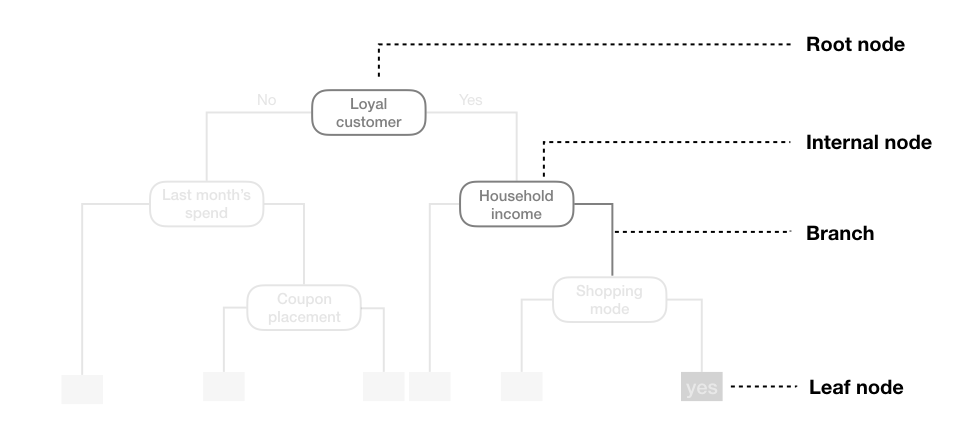
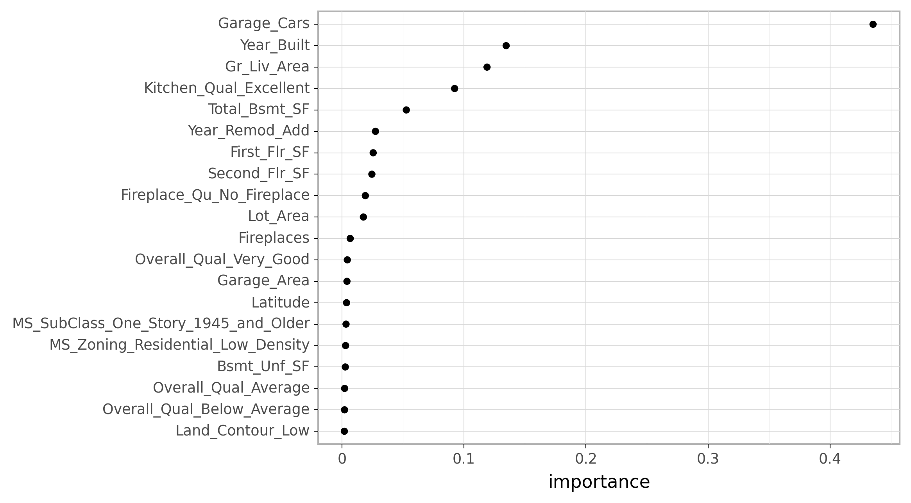
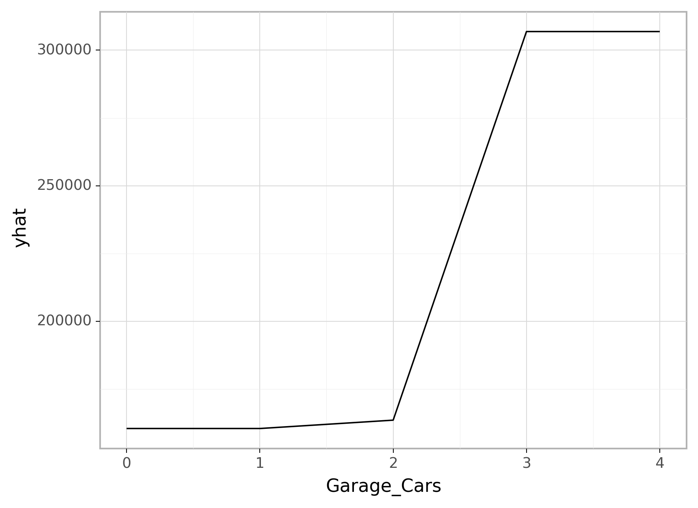

<br>

```{r setup, include=FALSE}

# Set global knitr chunk options
knitr::opts_chunk$set(echo = TRUE, warning = FALSE, message = FALSE, 
                      collapse = TRUE, fig.align = 'center')

library(reticulate)
use_virtualenv("/Users/b294776/Desktop/Workspace/Projects/misk/misk-homl/venv", required = TRUE)

# Set the graphical theme
ggplot2::theme_set(ggplot2::theme_light())

# hidden requirements
library(rpart)
library(rpart.plot)
```

```{python, echo = FALSE}
import plotnine
plotnine.themes.theme_set(new=plotnine.themes.theme_light())
```

# Learning objectives

By the end of this module you will know:

- How decision tree models partition data and how the depth of a tree impacts performance.
- Train, fit, tune and assess decision tree models.
- Identify important features and visualize their influence on the response.

# Prerequisites {.tabset}


## `r fontawesome::fa("python")` 

```{python}
# Helper packages
import numpy as np
import pandas as pd
from plotnine import *
from matplotlib import pyplot as plt

# Modeling packages
from sklearn.tree import DecisionTreeRegressor
from sklearn.tree import plot_tree
from sklearn.model_selection import train_test_split
from sklearn.preprocessing import OneHotEncoder
from sklearn.compose import ColumnTransformer
from sklearn.compose import make_column_selector as selector
from sklearn.model_selection import KFold
from sklearn.model_selection import cross_val_score
from sklearn.model_selection import GridSearchCV
from sklearn.inspection import partial_dependence
```

```{python}
# Ames housing data
ames = pd.read_csv("data/ames.csv")

# create train/test split
train, test = train_test_split(ames, train_size=0.7, random_state=123)

# separate features from labels and only use numeric features
X_train = train.drop("Sale_Price", axis=1)
y_train = train[["Sale_Price"]]
```

## `r fontawesome::fa("r-project")` 

```{r}
# Helper packages
library(tidyverse)   # for data wrangling & plotting

# Modeling packages
library(tidymodels) 

# Model interpretability packages
library(vip)         # for variable importance
library(pdp)         # for variable relationships
```

```{r ames-train}
# Stratified sampling with the rsample package
set.seed(123)
ames <- AmesHousing::make_ames()
split  <- rsample::initial_split(ames, prop = 0.7, strata = "Sale_Price")
ames_train  <- rsample::training(split)
ames_test   <- rsample::testing(split)
```

# Structure

There are many methodologies for constructing decision trees but the most well-known is the **c**lassification **a**nd **r**egression **t**ree (CART) algorithm proposed in @breiman2017classification.^[Other decision tree algorithms include the Iterative Dichotomiser 3 [@quinlan1986induction], C4.5 [@quinlan1996bagging], Chi-square automatic interaction detection [@kass1980exploratory], Conditional inference trees [@hothorn2006unbiased], and more.] A basic decision tree partitions the training data into homogeneous subgroups (i.e., groups with similar response values) and then fits a simple _constant_ in each subgroup (e.g., the mean of the within group response values for regression). The subgroups (also called nodes) are formed recursively using binary partitions formed by asking simple yes-or-no questions about each feature (e.g., is `age < 18`?). This is done a number of times until a suitable stopping criteria is satisfied (e.g., a maximum depth of the tree is reached). After all the partitioning has been done, the model predicts the output based on (1) the average response values for all observations that fall in that subgroup (regression problem), or (2) the class that has majority representation (classification problem). For classification, predicted probabilities can be obtained using the proportion of each class within the subgroup.

What results is an inverted tree-like structure such as that in the below figure.  In essence, our tree is a set of rules that allows us to make predictions by asking simple yes-or-no questions about each feature.  For example, if the customer is loyal, has household income greater than \$150,000, and is shopping in a store, the exemplar tree diagram below would predict that the customer will redeem a coupon. 

```{r exemplar-decision-tree, echo=FALSE, fig.cap="Figure: Exemplar decision tree predicting whether or not a customer will redeem a coupon (yes or no) based on the customer's loyalty, household income, last month's spend, coupon placement, and shopping mode.", out.height="100%", out.width="100%"}
knitr::include_graphics("images/exemplar-decision-tree.png")
```

We refer to the first subgroup at the top of the tree as the _root node_ (this node contains all of the training data). The final subgroups at the bottom of the tree are called the _terminal nodes_ or _leaves_. Every subgroup in between is referred to as an internal node. The connections between nodes are called _branches_. 

```{r decision-tree-terminology, echo=FALSE, fig.cap="Figure: Terminology of a decision tree.", out.height="80%", out.width="80%"}

```


# Partitioning

As illustrated above, CART uses _binary recursive partitioning_ (it's recursive because each split or rule depends on the the splits above it). The objective at each node is to find the "best" feature ($x_i$) to partition the remaining data into one of two regions ($R_1$ and $R_2$) such that the overall error between the actual response ($y_i$) and the predicted constant ($c_i$) is minimized.  For regression problems, the objective function to minimize is the total SSE as defined in the following equation:

\begin{equation}
SSE = \sum_{i \in R_1}\left(y_i - c_1\right)^2 + \sum_{i \in R_2}\left(y_i - c_2\right)^2
\end{equation}

For classification problems, the partitioning is usually made to maximize the reduction in cross-entropy or the Gini index (see [model evaluation](https://misk-data-science.github.io/misk-homl/docs/02-modeling-process.nb.html#classification_models)).^[Gini index and cross-entropy are the two most commonly applied loss functions used for decision trees. Classification error is rarely used to determine partitions as they are less sensitive to poor performing splits [@esl].] 

```{block, type='note'}
In both regression and classification trees, the objective of partitioning is to minimize dissimilarity in the terminal nodes. However, we suggest @therneau1997introduction for a more thorough discussion regarding binary recursive partitioning.
```

Having found the best feature/split combination, the data are partitioned into two regions and the splitting process is repeated on each of the two regions (hence the name binary recursive partitioning). This process is continued until a suitable stopping criterion is reached (e.g., a maximum depth is reached or the tree becomes "too complex").

It's important to note that a single feature can be used multiple times in a tree. For example, say we have data generated from a simple $\sin$ function with Gaussian noise: $Y_i \stackrel{iid}{\sim} N\left(\sin\left(X_i\right), \sigma^2\right)$, for $i = 1, 2, \dots, 500$. A regression tree built with a single root node (often referred to as a decision stump) leads to a split occurring at $x = 3.1$.

```{r decision-stump, echo=FALSE, fig.width=4, fig.height=3, fig.show='hold', fig.cap="Figure: Decision tree illustrating the single split on feature x (left). The resulting decision boundary illustrates the predicted value when x < 3.1 (0.64), and when x > 3.1 (-0.67) (right).", out.width="48%"}
# create data
set.seed(1112)  # for reproducibility
df <- tibble::tibble(
  x = seq(from = 0, to = 2 * pi, length = 500),
  y = sin(x) + rnorm(length(x), sd = 0.5),
  truth = sin(x)
)

# run decision stump model
library(rpart)
ctrl <- list(cp = 0, minbucket = 5, maxdepth = 1)
fit <- rpart(y ~ x, data = df, control = ctrl)

# plot tree 
library(rpart.plot)
par(mar = c(1, 1, 1, 1))
rpart.plot(fit)

# plot decision boundary
library(ggplot2)
library(dplyr)
df %>%
  mutate(pred = predict(fit, df)) %>%
  ggplot(aes(x, y)) +
  geom_point(alpha = .2, size = 1) +
  geom_line(aes(x, y = truth), color = "blue", size = .75) +
  geom_line(aes(y = pred), color = "red", size = .75) +
  geom_segment(x = 3.1, xend = 3.1, y = -Inf, yend = -.95,
               arrow = arrow(length = unit(0.25,"cm")), size = .25) +
  annotate("text", x = 3.1, y = -Inf, label = "split", hjust = 1.2, vjust = -1, size = 3) +
  geom_segment(x = 5.5, xend = 6, y = 2, yend = 2, size = .75, color = "blue") +
  geom_segment(x = 5.5, xend = 6, y = 1.7, yend = 1.7, size = .75, color = "red") +
  annotate("text", x = 5.3, y = 2, label = "truth", hjust = 1, size = 3, color = "blue") +
  annotate("text", x = 5.3, y = 1.7, label = "decision boundary", hjust = 1, size = 3, color = "red")
```

If we build a deeper tree, we'll continue to split on the same feature ($x$) as illustrated below. This is because $x$ is the only feature available to split on so it will continue finding the optimal splits along this feature's values until a pre-determined stopping criteria is reached. 

```{r depth-3-decision-tree, echo=FALSE, fig.width=4, fig.height=3, fig.show='hold', fig.cap="Figure: Decision tree illustrating with depth = 3, resulting in 7 decision splits along values of feature x and 8 prediction regions (left). The resulting decision boundary (right).", out.width="48%"}
# fit depth 3 decision tree
ctrl <- list(cp = 0, minbucket = 5, maxdepth = 3)
fit <- rpart(y ~ x, data = df, control = ctrl)
rpart.plot(fit)

# plot decision boundary
df %>%
  mutate(pred = predict(fit, df)) %>%
  ggplot(aes(x, y)) +
  geom_point(alpha = .2, size = 1) +
  geom_line(aes(x, y = truth), color = "blue", size = .75) +
  geom_line(aes(y = pred), color = "red", size = .75)
```

However, even when many features are available, a single feature may still dominate if it continues to provide the best split after each successive partition.  For example, a decision tree applied to the iris data set [@fisher1936use] where the species of the flower (setosa, versicolor, and virginica) is predicted based on two features (sepal width and sepal length) results in an optimal decision tree with two splits on each feature.  Also, note how the decision boundary in a classification problem results in rectangular regions enclosing the observations. The predicted value is the response class with the greatest proportion within the enclosed region.

```{r iris-decision-tree, echo=FALSE, fig.width=4, fig.height=3, fig.show='hold', fig.cap="Figure: Decision tree for the iris classification problem (left). The decision boundary results in rectangular regions that enclose the observations.  The class with the highest proportion in each region is the predicted value (right).", out.width="48%", warning=FALSE, message=FALSE}
# decision tree
iris_fit <- rpart(Species ~ Sepal.Length + Sepal.Width, data = iris)
rpart.plot(iris_fit)

# decision boundary
ggplot(iris, aes(Sepal.Length, Sepal.Width, color = Species, shape = Species)) +
  geom_point(show.legend = FALSE) +
  annotate("rect", xmin = -Inf, xmax = 5.44, ymin = 2.8, ymax = Inf, alpha = .75, fill = "orange") +
  annotate("text", x = 4.0, y = 4.4, label = "setosa", hjust = 0, size = 3) +
  annotate("rect", xmin = -Inf, xmax = 5.44, ymin = 2.79, ymax = -Inf, alpha = .75, fill = "grey") +
  annotate("text", x = 4.0, y = 2, label = "versicolor", hjust = 0, size = 3) +
  annotate("rect", xmin = 5.45, xmax = 6.15, ymin = 3.1, ymax = Inf, alpha = .75, fill = "orange") +
  annotate("text", x = 6, y = 4.4, label = "setosa", hjust = 1, vjust = 0, size = 3) +
  annotate("rect", xmin = 5.45, xmax = 6.15, ymin = 3.09, ymax = -Inf, alpha = .75, fill = "grey") +
  annotate("text", x = 6.15, y = 2, label = "versicolor", hjust = 1, vjust = 0, fill = "grey", size = 3) +
  annotate("rect", xmin = 6.16, xmax = Inf, ymin = -Inf, ymax = Inf, alpha = .75, fill = "green") +
  annotate("text", x = 8, y = 2, label = "virginica", hjust = 1, vjust = 0, fill = "green", size = 3)

```


# How deep?

This leads to an important question: how deep (i.e., complex) should we make the tree?  If we grow an overly complex tree as in the below figure, we tend to overfit to our training data resulting in poor generalization performance.

```{r deep-overfit-tree, echo=FALSE, fig.width=4, fig.height=3, fig.show='hold', fig.cap="Figure: Overfit decision tree with 56 splits.", out.width="48%"}
ctrl <- list(cp = 0, minbucket = 1, maxdepth = 50)
fit <- rpart(y ~ x, data = df, control = ctrl)
rpart.plot(fit)

df %>%
  mutate(pred = predict(fit, df)) %>%
  ggplot(aes(x, y)) +
  geom_point(alpha = .2, size = 1) +
  geom_line(aes(x, y = truth), color = "blue", size = 0.75) +
  geom_line(aes(y = pred), color = "red", size = 0.75)
```

Consequently, there is a balance to be achieved in the depth and complexity of the tree to optimize predictive performance on future unseen data. To find this balance, we have two primary approaches: (1) early stopping and (2) pruning. 

## Early stopping

Early stopping explicitly restricts the growth of the tree.  There are several ways we can restrict tree growth but two of the most common approaches are to restrict the tree depth to a certain level or to restrict the minimum number of observations allowed in any terminal node. When limiting tree depth we stop splitting after a certain depth (e.g., only grow a tree that has a depth of 5 levels).  The shallower the tree the less variance we have in our predictions; however, at some point we can start to inject too much bias as shallow trees (e.g., stumps) are not able to capture interactions and complex patterns in our data. 

When restricting minimum terminal node size (e.g., leaf nodes must contain at least 10 observations for predictions) we are deciding to not split intermediate nodes which contain too few data points. At the far end of the spectrum, a terminal node's size of one allows for a single observation to be captured in the leaf node and used as a prediction (in this case, we're interpolating the training data).  This results in high variance and poor generalizability.  On the other hand, large values restrict further splits therefore reducing variance.  

These two approaches can be implemented independently of one another; however, they do have interaction effects as illustrated below. 

```{r dt-early-stopping, fig.width=10, fig.height=8, fig.cap="Figure: Illustration of how early stopping affects the decision boundary of a regression decision tree. The columns illustrate how tree depth impacts the decision boundary and the rows illustrate how the minimum number of observations in the terminal node influences the decision boundary.", echo=FALSE}
hyper_grid <- expand.grid(
  maxdepth = c(1, 5, 15),
  minbucket = c(1, 5, 15)
)
results <- data.frame(NULL)

for(i in seq_len(nrow(hyper_grid))) {
 ctrl <- list(cp = 0, maxdepth = hyper_grid$maxdepth[i], minbucket = hyper_grid$minbucket[i])
 fit <- rpart(y ~ x, data = df, control = ctrl) 
 
 predictions <- mutate(
   df, 
   minbucket = factor(paste("Min node size =", hyper_grid$minbucket[i]), ordered = TRUE),
   maxdepth = factor(paste("Max tree depth =", hyper_grid$maxdepth[i]), ordered = TRUE)
   )
 predictions$pred <- predict(fit, df)
 results <- rbind(results, predictions)
   
}

ggplot(results, aes(x, y)) +
  geom_point(alpha = .2, size = 1) +
  geom_line(aes(x, y = truth), color = "blue", size = .75) +
  geom_line(aes(y = pred), color = "red", size = 1) +
  facet_grid(minbucket ~ maxdepth)
```

## Pruning

An alternative to explicitly specifying the depth of a decision tree is to grow a very large, complex tree and then _prune_ it back to find an optimal subtree. We find the optimal subtree by using a _cost complexity parameter_ ($\alpha$) that penalizes our objective function for the number of terminal nodes of the tree ($T$) as in the following equation.

\begin{equation}
 \texttt{minimize} \left\{ SSE + \alpha \vert T \vert \right\}
\end{equation}

For a given value of $\alpha$ we find the smallest pruned tree that has the lowest penalized error. You may recognize the close association to the lasso penalty discussed in the [regularized regression module](https://misk-data-science.github.io/misk-homl/docs/notebooks/06-regularized-regression.html). As with the regularization methods, smaller penalties tend to produce more complex models, which result in larger trees. Whereas larger penalties result in much smaller trees. Consequently, as a tree grows larger, the reduction in the SSE must be greater than the cost complexity penalty. Typically, we evaluate multiple models across a spectrum of $\alpha$ and use CV to identify the optimal value and, therefore, the optimal subtree that generalizes best to unseen data.

```{r pruned-tree, fig.width=10, fig.height = 4, fig.cap="Figure: To prune a tree, we grow an overly complex tree (left) and then use a cost complexity parameter to identify the optimal subtree (right).", echo=FALSE}
ctrl <- list(cp = 0, minbucket = 1, maxdepth = 50)
fit <- rpart(y ~ x, data = df, control = ctrl)

p1 <- df %>%
  mutate(pred = predict(fit, df)) %>%
  ggplot(aes(x, y)) +
  geom_point(alpha = .3, size = 2) +
  geom_line(aes(x, y = truth), color = "blue", size = 1) +
  geom_line(aes(y = pred), color = "red", size = 1)

fit2 <- rpart(y ~ x, data = df)

p2 <- df %>%
  mutate(pred2 = predict(fit2, df)) %>%
  ggplot(aes(x, y)) +
  geom_point(alpha = .3, size = 2) +
  geom_line(aes(x, y = truth), color = "blue", size = 1) +
  geom_line(aes(y = pred2), color = "red", size = 1)

gridExtra::grid.arrange(p1, p2, nrow = 1)
```


# Basic implementation

## Simple model {.tabset}

To illustrate some of the concepts we've mentioned we'll start by implementing models using just the `Gr_Liv_Area` and `Year_Built` features in our Ames housing data.

### `r fontawesome::fa("python")` 

In Python we use the `DecisionTreeRegressor` and `DecisionTreeClassifier` classes from the `sklearn.tree` module.  In this example we'll fit a shallow tree that is only 3 levels deep.

```{python}
# Step 1: create model object
dt_mod = DecisionTreeRegressor(max_depth=3)

# Step 2: fit/train model
dt_fit = dt_mod.fit(X_train[["Gr_Liv_Area", "Year_Built"]], y_train)
```

After 3 levels of decision splits, our model has 8 prediction leaf nodes.

```{python}
dt_fit.get_n_leaves()
```

We can use the `plot_tree()` function to visualize our tree. This is only useful if we have a relatively small tree to visualize; however, most trees we will build will be far too large to attempt to visualize. In this case, we see that the root node (first node) splits our data based on `X[1]` (`Year_Built`). For those observations where the home is built after 1985 we follow the right half of the decision tree and for those where the home is built in or prior to 1985 we follow the left half of the decision tree.

```{python}
plot_tree(dt_fit)
plt.show()
```

However, to understand how our model is performing we want to perform cross validation. In this example we will not limit the depth of our tree. We see that this single decision tree is not performing spectacularly with the RMSE across our 5 folds equalling about \$50K. 

```{python}
# create DT model object
dt_mod = DecisionTreeRegressor()

# define loss function
loss = 'neg_root_mean_squared_error'

# create 5 fold CV object
kfold = KFold(n_splits=5, random_state=123, shuffle=True)

# fit model with 5-fold CV
results = cross_val_score(dt_mod, X_train[["Gr_Liv_Area", "Year_Built"]], 
                          y_train, cv=kfold, scoring=loss)


np.round(np.abs(results))
```

### `r fontawesome::fa("r-project")` 

In R we use the `decision_tree()` model and we'll use the `rpart` package as our model engine. In this example we will not set a specific depth of our tree; rather, `rpart` automatically builds a fully deep tree and then prunes it to attempt to find an optimal tree depth.

```{r}
# Step 1: create ridge model object
dt_mod <- decision_tree(mode = "regression") %>% set_engine("rpart")

# Step 2: create model recipe
model_recipe <- recipe(
    Sale_Price ~ Gr_Liv_Area + Year_Built, 
    data = ames_train
  )
  
# Step 3: fit model workflow
dt_fit <- workflow() %>%
  add_recipe(model_recipe) %>%
  add_model(dt_mod) %>%
  fit(data = ames_train)

# Step 4: results
dt_fit
```

If we plot our tree we see that the root node is the same as the Python example. For those observations where the home is built after 1985 we follow the right half of the decision tree and for those where the home is built in or prior to 1985 we follow the left half of the decision tree.

```{r}
rpart.plot(dt_fit$fit$fit$fit)
```

However, to understand how our model is performing we want to perform cross validation. We see that this single decision tree is not performing spectacularly well with the average RMSE across our 5 folds equalling just under \$50K. 

```{r}
# create resampling procedure
set.seed(13)
kfold <- vfold_cv(ames_train, v = 5)

# train model
results <- fit_resamples(dt_mod, model_recipe, kfold)

# model results
collect_metrics(results)
```


## Full model {.tabset}

Next, lets go ahead and fit a full model to include all Ames housing features.

### `r fontawesome::fa("python")` 

In Python we must convert our categorical features to numeric values. For this example we'll simply dummy encode them using Pandas `get_dummies()`. We see some improvement in our model performance as our average cross validated RMSE is now in the low \$40K range.

```{python}
# create new feature set with encoded features
X_train_encoded = pd.get_dummies(X_train)

# fit model with 5-fold CV
results = cross_val_score(dt_mod, X_train_encoded, y_train, cv=kfold, scoring=loss)

np.abs(np.mean(results))
```


### `r fontawesome::fa("r-project")` 

In R, we do not need to one-hot encode our features as rpart will naturally handle categorical features. By including all features we see some improvement in our model performance as our average cross validated RMSE is now in the low \$40K range.

```{r}
# create model recipe with all features
full_model_recipe <- recipe(
    Sale_Price ~ ., 
    data = ames_train
  )

# train model
results <- fit_resamples(dt_mod, full_model_recipe, kfold)

# model results
collect_metrics(results)
```


# Tuning {.tabset}

As previously mentioned, the tree depth is the primary factor that impacts performance. We can control tree depth via a few different parameters:

1. Max depth: we can explicitly state the maximum depth a tree can be grown.
2. Minimium observations for a split: The minimum number of samples required to split an internal node. This limits a tree from continuing to grow as the number of observations in a give node becomes smaller.
3. Cost complexity parameter: acts as a regularization mechanism by penalizing the objective function.

There is not one best approach to use and often different combinations of these parameter settings improves model performance. The following will demonstrate a small grid search across 3 different values for each of these parameters ($3^3 = 27$ total setting combinations). 

Note that each language has additional default parameters that often differ so we can find a combination of values that optimizes the Python implementation, which differs from the optimal R implementation.  In both examples we see the optimal model decreases our average CV RMSE into the mid-to-upper \$30K range.

```{block, type='tip'}
It is common to run additional grid searches after the first grid search. These additional grid searches uses the first grid search to find parameter values that perform well and then continue to analyze additional ranges around these values.
```

## `r fontawesome::fa("python")` 

```{python}
# create model object
dt_mod = DecisionTreeRegressor()

# define loss function
loss = 'neg_root_mean_squared_error'

# create 5 fold CV object
kfold = KFold(n_splits=5, random_state=123, shuffle=True)

# Create grid of hyperparameter values
hyper_grid = {
  'ccp_alpha': [1e-1, 1e-5, 1e-10],
  'max_depth': [1, 8, 15],
  'min_samples_split': [2, 21, 40]
  }
```

```{python}
grid_search = GridSearchCV(dt_mod, hyper_grid, cv=kfold, scoring=loss)
results = grid_search.fit(X_train_encoded, y_train)

# Optimal penalty parameter in grid search
results.best_estimator_
```

```{python}
# Best model's cross validated RMSE
round(abs(results.best_score_), 2)
```

## `r fontawesome::fa("r-project")` 


```{r}
# create model object with tuning options
dt_mod <- decision_tree(
  mode = "regression",
  cost_complexity = tune(),
  tree_depth = tune(),
  min_n = tune()
  ) %>% 
  set_engine("rpart")

# create the hyperparameter grid
hyper_grid <- grid_regular(
 cost_complexity(), 
 tree_depth(),
 min_n()
 )

# train our model across the hyper parameter grid
set.seed(123)
results <- tune_grid(dt_mod, full_model_recipe, resamples = kfold, grid = hyper_grid)

# get best results
show_best(results, metric = "rmse", n = 10)
```


# Feature interpretation {.tabset}

We can use a similar approach as we have in the past to find the most influential features in our decision tree models. For both R and Python we see similar features that appear to be leading influencers in our models. And the partial dependence plots show our relationships are no longer assuming any type of linear relationship.

## `r fontawesome::fa("python")` 

```{python, eval=FALSE}
# create final model object
best_mod = results.best_estimator_
best_mod_fit = best_mod.fit(X_train_encoded, y_train)

# extract feature importances
vi = pd.DataFrame({'feature': X_train_encoded.columns,
                   'importance': best_mod_fit.feature_importances_})

# get top 20 influential features
top_20_features = vi.nlargest(20, 'importance')

# plot feature importance
(ggplot(top_20_features, aes(x='importance', y='reorder(feature, importance)'))
 + geom_point()
 + labs(y=None))
```

```{python py-dt-vip-output, echo=FALSE}
# create final model object
best_mod = results.best_estimator_
best_mod_fit = best_mod.fit(X_train_encoded, y_train)

# extract feature importances
vi = pd.DataFrame({'feature': X_train_encoded.columns,
                   'importance': best_mod_fit.feature_importances_})

# get top 20 influential features
top_20_features = vi.nlargest(20, 'importance')

# plot feature importance
p = (ggplot(top_20_features, aes(x='importance', y='reorder(feature, importance)'))
 + geom_point()
 + labs(y=None))
 
p.save(filename="py-dt-vip-output.png", path = "./images", dpi = 300, verbose = False)
```

```{r, echo=FALSE, fig.align='center', out.width="90%"}

```

```{python, eval=FALSE}
pd_results = partial_dependence(
  best_mod_fit, X_train_encoded, "Garage_Cars", kind='average',
  percentiles=(0, 1)) 
  
pd_output = pd.DataFrame({'Garage_Cars': pd_results['values'][0],
                          'yhat': pd_results['average'][0]})
                          
(ggplot(pd_output, aes('Garage_Cars', 'yhat'))
  + geom_line())
```

```{python py-dt-pdp-output, echo=FALSE}
pd_results = partial_dependence(
  best_mod_fit, X_train_encoded, "Garage_Cars", kind='average',
  percentiles=(0, 1)) 
  
pd_output = pd.DataFrame({'Garage_Cars': pd_results['values'][0],
                          'yhat': pd_results['average'][0]})
                          
p = (ggplot(pd_output, aes('Garage_Cars', 'yhat'))
  + geom_line())
 
p.save(filename="py-dt-pdp-output.png", path = "./images", dpi = 300, verbose = False)
```

```{r, echo=FALSE, fig.align='center', out.width="90%"}

```

## `r fontawesome::fa("r-project")` 

```{r}
best_model <- select_best(results, 'rmse')

final_model <- decision_tree(
  mode = "regression",
  cost_complexity = best_model$cost_complexity,
  tree_depth = best_model$tree_depth,
  min_n = best_model$min_n
  ) %>% 
  set_engine("rpart")

final_fit <- workflow() %>%
  add_recipe(full_model_recipe) %>%
  add_model(final_model) %>%
  fit(data = ames_train)

final_fit %>%
  pull_workflow_fit() %>%
  vip(20)
```

```{r}
# prediction function
pdp_pred_fun <- function(object, newdata) {
  mean(predict(object, newdata, type = "numeric")$.pred)
}

# use the pdp package to extract partial dependence predictions
# and then plot
final_fit %>%
  pdp::partial(
   pred.var = "Overall_Qual", 
   pred.fun = pdp_pred_fun,
   grid.resolution = 10, 
   train = ames_train
  ) %>%
  ggplot(aes(yhat, Overall_Qual)) +
  geom_col() +
  scale_x_continuous(labels = scales::dollar)
```

# Final thoughts

Decision trees have a number of advantages. Trees require very little pre-processing. This is not to say feature engineering may not improve upon a decision tree, but rather, that there are no pre-processing requirements. Monotonic transformations (e.g., $\log$, $\exp$, and $\sqrt{}$) are not required to meet algorithm assumptions as in many parametric models; instead, they only shift the location of the optimal split points. Outliers typically do not bias the results as much since the binary partitioning simply looks for a single location to make a split within the distribution of each feature. 

Decision trees can easily handle categorical features without preprocessing. For unordered categorical features with more than two levels, the classes are ordered based on the outcome (for regression problems, the mean of the response is used and for classification problems, the proportion of the positive outcome class is used). For more details see @esl, @breiman1984nonlinear, @ripley2007pattern, @fisher1958grouping, and @loh1988tree.

Missing values often cause problems with statistical models and analyses. Most procedures deal with them by refusing to deal with them---incomplete observations are tossed out. However, most decision tree implementations can easily handle missing values in the features and do not require imputation.  This is handled in various ways but most commonly by creating a new "missing" class for categorical variables or using surrogate splits (see @therneau1997introduction for details).

However, individual decision trees generally do not often achieve state-of-the-art predictive accuracy. In this module, we saw that the best pruned decision tree, although it performed better than linear regression, had a very poor RMSE (~\$41,000) compared to some of the other models we've built.  This is driven by the fact that decision trees are composed of simple yes-or-no rules that create rigid non-smooth decision boundaries.  Furthermore, we saw that deep trees tend to have high variance (and low bias) and shallow trees tend to be overly bias (but low variance). In the modules that follow, we'll see how we can combine multiple trees together into very powerful prediction models called *ensembles*.

# Exercises

Using the Boston housing data set, where the response feature is the median value of homes within a census tract (`cmedv`):

1. Apply a decision tree model with all features.
2. How many internal splitting nodes optimize model performance?
3. Can you identify the predicted values and SEE in the terminal nodes?
4. Identify the first feature split node and explain how it is splitting this feature.
5. Which 10 features are considered most influential? Are these the same features that have been influential in previous models?
6. Now perform 1-5 to the Attrition dataset, which is classification model rather than a regression model.

[🏠](https://github.com/misk-data-science/misk-homl)

# References
